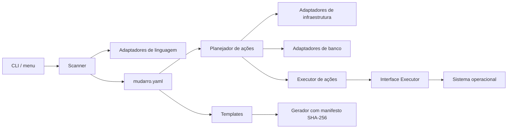

# Arquitetura do Mudarro

O Mudarro é uma CLI determinística, sem serviços remotos de inferência. As bibliotecas YAML e TOML são incorporadas ao binário; não há runtime Python/Node obrigatório para a ferramenta.

## Responsabilidades e SOLID

| Princípio | Aplicação |
|---|---|
| Responsabilidade única | Configuração valida dados; scanner identifica evidências; adaptadores descrevem ações; geração controla arquivos; runner executa; CLI/menu apresentam o fluxo. |
| Aberto/fechado | Adaptadores implementam contratos pequenos e entram nos registros de linguagem, infraestrutura ou banco. O menu e o runner não conhecem frameworks específicos. |
| Substituição | Adaptadores entregam o mesmo modelo de serviço/ação; uma ação indisponível informa `Blocked`, sem executar efeitos durante planejamento. |
| Segregação de interfaces | `LanguageAdapter`, `InfrastructureAdapter`, `DatabaseAdapter` e `Executor` têm contratos distintos. Nenhum adaptador precisa implementar operações alheias à sua função. |
| Inversão de dependência | O runner recebe `Executor`; testes podem substituir a execução do sistema. Adaptadores retornam descrições, sem depender de `exec.Command`. Entrada/saída da CLI são injetadas. |

Os adaptadores usam **Strategy**, os registros fazem a composição e `Action` representa um comando planejado. Não há carregamento de plugins remotos nem `eval` para interpretar configurações.

O código permanece em um pacote interno com arquivos por responsabilidade: evita exportar uma API pública prematura. O contrato público é a CLI e a configuração `version: 1`. O supervisor de processos é um detalhe do adaptador local e usa APIs Unix; Windows nativo não é suportado.

## Extensão

1. Implementar o contrato correspondente com detecção por evidências, sem executar arquivos do projeto.
2. Registrar o adaptador na composição e, se necessário, adicionar templates em `templates.go`.
3. Retornar comandos em `args`; usar shell somente quando declarado pelo usuário.
4. Cobrir detecção, ambiguidade, requisitos e execução em fixture isolada.
5. Atualizar a matriz de suporte, documentação e Docmap do Vault.

O gerador de templates está separado do controle de arquivos. As famílias de templates ainda são internas e selecionadas explicitamente; uma API de plugins de templates fica para uma evolução motivada por novos adaptadores.

## Estado

`mudarro.yaml` é versionável. `.mudarro/generated.json` armazena os hashes dos arquivos gerados, e `.mudarro/scripts/` contém wrappers. `.mudarro/run/` contém PID, token aleatório, identidade do projeto e logs privados do runtime local.

O manifesto evita sobrescrever edições manuais. Não é um mecanismo de autenticação contra usuários com acesso de escrita ao mesmo projeto. Um repositório com comandos configurados deve ser revisado antes de executar suas ações.
