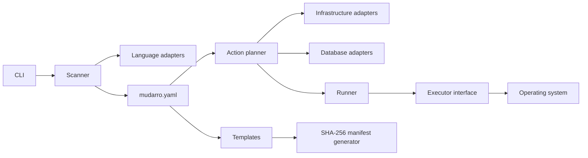

English · [Português (Brasil)](pt-BR/architecture.md)

## Current CI correction — MUD-030

Verified [push CI run37416072569](https://github.com/viralabs-dev/mudarro/actions/runs/37416072569), head `bade86e`: completed **failure**. Ubuntu, database and container jobs succeeded; macOS executed and failed in EOF-loop/race-cleanup handling, including panic with index n=-1. Therefore macOS is no longer globally “not executed”: local Darwin cross-compilation passed, but the actual CI runtime failed. Local Podman remains unavailable; container CI passed, distinct from local execution.

Authenticated Actions permissions read returned enabled=true/allowed_actions=all; this does not identify who changed settings. No workflow/config settings, enable action, dispatch or rerun was performed. This corrective commit uses the official [skip ci] marker for the authorized main-only push, honoring the requested no-Actions execution without changing settings. Earlier raw gates/evidence are preserved as historical and superseded for current CI status. Local Linux74-test/76.38% results remain valid for their recorded checkpoint. The portability fix passed 75 local Linux tests with race, vet and Linux/Darwin arm64 compilation. Corrected macOS runtime remains unvalidated; skipping CI does not mean it passed.

# Mudarro architecture

Mudarro is deterministic and has no remote inference service. YAML/TOML libraries are embedded; the CLI does not require Python or Node. Its public contract is the CLI and `version: 1` configuration. The local supervisor uses Unix APIs; native Windows is unsupported.



Configuration validates data; scanning gathers evidence; adapters describe actions; generation controls files; runners execute; the CLI presents and selects. Adapters implement small consumer-owned interfaces and register through composition. Unavailable actions carry `Blocked`. They do not execute project code while planning. Explicit commands override adapter actions; sorted actions drive the menu. This applies Strategy, interface segregation and dependency inversion without a DI framework, class hierarchy, remote plugin loader or configuration eval.

## Extension

Implement evidence-based detection without running project files, register the adapter, add templates if needed, prefer structured argv, and use shell only when explicitly configured. Test detection, ambiguity, prerequisites and execution in isolated fixtures. Update support documentation and the Vault Docmap. Template families remain internal; a plugin API requires a concrete use case.

## State

`mudarro.yaml` is versionable. `.mudarro/generated.json` records generated hashes; `.mudarro/scripts/` holds wrappers; `.mudarro/run/` holds PID, random token, project identity and private local logs. The manifest protects manual edits, not authentication against another writer. Review configured commands before execution.

## ADR-MUD-010 — idiomatic SOLID review, 2026-10-06

Applied locally, preserving CLI/YAML. Sources: [Effective Go](https://go.dev/doc/effective_go#interfaces), [Code Review Comments](https://go.dev/wiki/CodeReviewComments#interfaces), [os/exec](https://pkg.go.dev/os/exec).

Dockerfile ownership inspection now uses `Executor.Output` rather than direct `exec.Command`. Fakes prove owned-container resume, foreign-owner refusal and absent-container creation. OS execution rejects empty commands with an error instead of panic and preserves execution errors/exit codes. Dispatch stays in runner.go; local_runner.go owns Unix identity/signals, kubernetes_runner.go workload selection/storage preservation, sqlite_runner.go nontruncating creation.

The native supervisor stays concrete: it must spawn the executable, identify process groups and survive the CLI. Adding context cancellation everywhere could violate that lifecycle. Foreground cancellation would require a separate contract. CLI doctor uses executable lookup and config/generation use real temporary filesystems. These are deliberate limits, not complete OS isolation. Before/after regression evidence: [solid-before.txt](samples/menu-auto/evidence/solid-before.txt). Linux and Darwin cross-build passed; a cross-build is not macOS runtime validation.

## ADR-MUD-015 — internal responsibility packages

Applied locally on 2026-10-06 with explicit authorization, without commit/publication. This evolves file separation while preserving CLI/configuration compatibility.

```text
internal/mudarro/
  cli.go scan.go actions.go config.go generate.go templates.go
  runner.go local_runner.go kubernetes_runner.go sqlite_runner.go
  model.go                 # compatibility type aliases
  model/types.go           # Service, Command, Infrastructure, Database, Action, Suggestion
  adapters/                # language/infrastructure/database descriptions and setup
  executor/os.go           # OS Run/Output implementation
  projectfs/path.go        # guarded paths and bounded manifest reads
  terminal/                # menu, lettering, colors, ioctl
```

Dependencies: orchestration → adapters/model/executor/projectfs/terminal; adapters → model/projectfs. Other packages do not import orchestration. Compiler checks the acyclic graph. LanguageAdapter/InfrastructureAdapter/DatabaseAdapter/Executor remain consumer-owned; implementations satisfy them implicitly. Registries, overrides, validation, generation and runners remain at the root.

Model contains values without IO; aliases preserve type identity/tags. Projectfs retains relative-path, traversal and ancestor-symlink guards plus the 4 MiB manifest limit. It does not solve adversarial concurrent filesystem modification (TOCTOU). Terminal handles presentation only. Tradeoff: more imports and a small exported internal surface, with clearer compiler-enforced boundaries; no new public API/runtime/dependency. Final behavior and test-layout validation must be reported from the actual latest gates, not inferred from extraction. See [support](support-matrix.md) and [evidence](samples/menu-auto/README.md).

## Test source layout — MUD-017

All 41 Test functions now live under `test/internal/mudarro/...`: nine orchestration test files plus helpers, and two terminal test files plus four isolated PTY helpers. Tests exercise the public internal-package surface without production test hooks or overlays. Six terminal Linux tests passed with race using real isolated PTYs; consolidated gates and Darwin helper cross-compilation subsequently passed, as recorded below. macOS runtime was not validated in this local stage; current CI failed; platforms without supported PTY helpers explicitly skip the relevant tests. Historical 72.04% is not a post-migration measurement.

## Final test-tree gate — 2026-10-06

All 41 tests passed with race and explicit internal coverpkg instrumentation after relocation. Deduplicated coverage: **1,035/1,427 statements = 72.53% (Go displays 72.5%)**; previous 1,028/1,427=72.04% remains historical. Vet, Linux build, Darwin arm64 terminal-test cross-compilation and diff check passed. Darwin compilation is not macOS runtime. Test tree contains 16 files (nine orchestration test files plus one helper; two terminal test files plus four PTY helpers). No test hooks or overlays added to production.

Evidence: [test-tree-tests.txt](samples/menu-auto/evidence/test-tree-tests.txt), [test-tree-coverage.out](samples/menu-auto/evidence/test-tree-coverage.out), [test-tree-coverage-functions.txt](samples/menu-auto/evidence/test-tree-coverage-functions.txt), [test-tree-coverage-summary.tsv](samples/menu-auto/evidence/test-tree-coverage-summary.tsv), [test-tree-gates.txt](samples/menu-auto/evidence/test-tree-gates.txt).

## Consumer project identity — MUD-022

The menu title is the consumer project `Config.Name`, not the Mudarro tool name. The controlled sample now uses Aurora (package/config); demo and recording default explicitly to Aurora, overridable with `MUDARRO_SAMPLE_NAME`. The existing CLI already used Config.Name; demonstration inputs were corrected. User visual design acceptance has been received; only the genuine graphical screenshot remains pending.

Text sanitization strips controls and Unicode Cf formatting characters. Conservative terminal-cell estimation counts CJK/fullwidth/emoji as two cells and combining marks as zero; it is not a complete grapheme/terminal-width guarantee. Unsupported bitmap glyphs or an excessively long wordmark fall back to readable text instead of presenting an incorrect identity.

The current name stage has 43 Test functions and 24 rich/narrow/plain/NO_COLOR name-mode cases, covering AtlasAPI, Aurora, Café, 漢字😀, long names and control injection, plus explicit consumer-name CLI integration. Race passed; the final coverage and build gates passed as recorded below. Previous stage coverage remains historical. Genuine latest media belongs in `evidence/project-name-visual/` under the canonical sample; `evidence/packages-visual/` remains historical.

## Current consumer-name validation — MUD-022

43 Test functions passed with race, including 24 consumer-name/mode cases. Vet, Linux build, Darwin arm64 terminal-test cross-compilation and Bash syntax passed. Coverage: **1,063/1,451 statements = 73.26% (Go displays 73.3%)**, 388 unexecuted. Prior MUD-017 1,035/1,427=72.53% is historical; changed code and denominator preclude interpreting the difference as equivalent requirement coverage. macOS runtime was not exercised in this historical local stage; current CI runtime failed as recorded above.

Real final GIF: 983×739, 8 frames, 15.04 s. Composed frame inspected: AURORA lettering and PROJETO / Aurora. This is a real PTY recording frame, not the still-pending graphical screenshot. User design approval received. Binary SHA-256: `ef36e6c1142bd7294e543208895cea21e125c6898d14ec168e40c1c7eb327890`.

Evidence: [project-name-tests.txt](samples/menu-auto/evidence/project-name-tests.txt), [project-name-coverage.out](samples/menu-auto/evidence/project-name-coverage.out), [project-name-coverage-functions.txt](samples/menu-auto/evidence/project-name-coverage-functions.txt), [project-name-coverage-summary.tsv](samples/menu-auto/evidence/project-name-coverage-summary.tsv), [project-name-vet.txt](samples/menu-auto/evidence/project-name-vet.txt), [project-name-visual/frame-menu-recording.png](samples/menu-auto/evidence/project-name-visual/frame-menu-recording.png).

Current implementation: [UI configuration](ui-configuration.md). Core configuration/i18n/theme/action-preview implemented; fonts and actual-emulator mouse acceptance remain separate pending work. Final gates:74 tests,76.38% aggregate statements; see [coverage](coverage.md).
