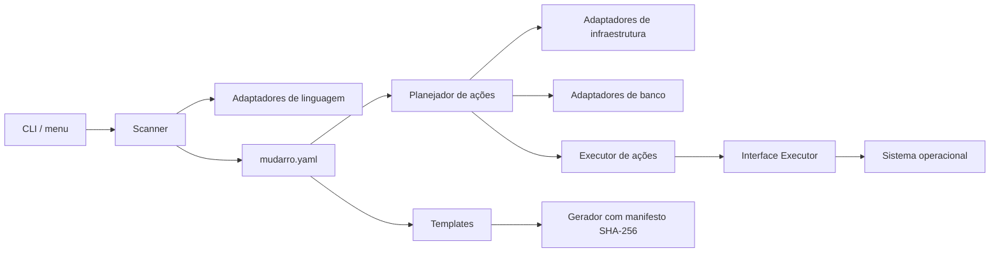

[English](../architecture.md) · Português (Brasil)

# Arquitetura do Mudarro

O Mudarro é uma CLI determinística, sem serviços remotos de inferência. As bibliotecas YAML e TOML são incorporadas ao binário; não há runtime Python/Node obrigatório para a ferramenta.



## Responsabilidades e SOLID

| Princípio | Aplicação |
|---|---|
| Responsabilidade única | Configuração valida dados; scanner identifica evidências; adaptadores descrevem ações; geração controla arquivos; runner executa; CLI/menu apresentam o fluxo. |
| Aberto/fechado | Adaptadores implementam contratos pequenos e entram nos registros de linguagem, infraestrutura ou banco. O menu e o runner não conhecem frameworks específicos. |
| Substituição | Adaptadores entregam o mesmo modelo de serviço/ação; uma ação indisponível informa `Blocked`, sem executar efeitos durante planejamento. |
| Segregação de interfaces | `LanguageAdapter`, `InfrastructureAdapter`, `DatabaseAdapter` e `Executor` têm contratos distintos. Nenhum adaptador precisa implementar operações alheias à sua função. |
| Inversão de dependência | O runner recebe `Executor`; testes podem substituir a execução do sistema. Adaptadores retornam descrições, sem depender de `exec.Command`. Entrada/saída da CLI são injetadas. |

Os adaptadores usam **Strategy**, os registros fazem a composição e `Action` representa um comando planejado. Não há carregamento de plugins remotos nem `eval` para interpretar configurações.

O código possui pacotes internos por responsabilidade, conforme ADR-MUD-015 abaixo. O contrato público é a CLI e a configuração `version: 1`. O supervisor de processos é um detalhe do adaptador local e usa APIs Unix; Windows nativo não é suportado.

## Extensão

1. Implementar o contrato correspondente com detecção por evidências, sem executar arquivos do projeto.
2. Registrar o adaptador na composição e, se necessário, adicionar templates em `templates.go`.
3. Retornar comandos em `args`; usar shell somente quando declarado pelo usuário.
4. Cobrir detecção, ambiguidade, requisitos e execução em fixture isolada.
5. Atualizar a matriz de suporte, documentação e Docmap do Vault.

O gerador de templates está separado do controle de arquivos. As famílias de templates ainda são internas e selecionadas explicitamente; uma API de plugins de templates fica para uma evolução motivada por novos adaptadores.

## Estado

`mudarro.yaml` é versionável. `.mudarro/generated.json` armazena os hashes dos arquivos gerados, e `.mudarro/scripts/` contém wrappers. `.mudarro/run/` contém PID, token aleatório, identidade do projeto e logs privados do runtime local.

O manifesto evita sobrescrever edições manuais. Não é um mecanismo de autenticação contra usuários com acesso de escrita ao mesmo projeto. Um repositório com comandos configurados deve ser revisado antes de executar suas ações.

## Revisão de 2026-10-06 — ADR-MUD-010

Status: aplicado localmente; contrato CLI/YAML preservado. Revisão baseada em [Effective Go](https://go.dev/doc/effective_go#interfaces), [Go Code Review Comments](https://go.dev/wiki/CodeReviewComments#interfaces) e [os/exec](https://pkg.go.dev/os/exec).

O núcleo já separava configuração/scanner, planejamento/adaptadores, templates/geração e apresentação. A revisão encontrou uma exceção concreta à inversão de dependência: a inspeção de propriedade Dockerfile usava `exec.Command` diretamente. Agora usa `Executor.Output`, permitindo comprovar com fake que o runner retoma um container próprio, recusa outro proprietário e cria somente quando a inspeção falha. O executor OS também rejeita comandos vazios com erro, sem panic, e mantém o erro original de execução/código de saída.

O despacho permanece em `runner.go`; `local_runner.go` concentra supervisor Unix/identidade/sinais, `kubernetes_runner.go` seleciona workloads e preserva PVCs, e `sqlite_runner.go` cria arquivos sem truncar. São arquivos coesos no mesmo pacote interno: nenhum framework de DI, hierarquia de classes ou interface de uma implementação foi acrescentado. Os dois métodos de Executor são consumidos pelo runner; adaptadores continuam retornando descrições sem efeitos.

Tradeoff: a separação por arquivos melhora revisão e testes sem introduzir API pública ou dependências. Não significa isolamento total do SO: o supervisor local precisa iniciar o próprio executável, identificar grupos e tratar SIGTERM/SIGINT. A CLI/doctor usa lookup de executáveis; geração/configuração usam filesystem real com fixtures temporárias. Esses detalhes continuam concretos, documentados e exercitados por integração. Adicionar interfaces/context a todas as funções apenas para afirmar SOLID aumentaria indirection e poderia cancelar indevidamente um supervisor que deve sobreviver à CLI. O supervisor conserva seu protocolo de sinais; cancelamento estruturado de comandos foreground pode ser uma evolução separada com semântica/aceite explícitos.

Verificação: regressões falharam antes da correção (`samples/menu-auto/evidence/solid-before.txt`), passaram após, suíte Go/race final e vet passaram; CLI compilou Linux e Darwin arm64 (compilação cruzada não é smoke real macOS). [Matriz real](samples/menu-auto/README.md) separa os testes de unidade das execuções reais.

## ADR-MUD-015 — Pacotes internos por responsabilidade

Status: aplicado localmente em 2026-10-06 por autorização explícita, sem commit/publicação. Evolui a separação por arquivos do ADR-MUD-010; CLI e configuração version:1 permanecem compatíveis.

```text
internal/mudarro/
├── cli.go, scan.go, actions.go, config.go, generate.go, templates.go
├── runner.go, local_runner.go, kubernetes_runner.go, sqlite_runner.go
├── model.go                 # aliases de compatibilidade para valores compartilhados
├── model/types.go           # Service, Command, Infrastructure, Database, Action, Suggestion
├── adapters/                # detecção e descrições de ações; nunca executa subprocessos
│   ├── language_adapters.go
│   ├── infrastructure_adapters.go
│   ├── database_adapters.go
│   ├── database_setup.go
│   └── helpers.go
├── executor/os.go           # implementação OS de Run/Output
├── projectfs/path.go        # caminhos guardados e leitura limitada de manifests
└── terminal/                # menu renderizado, lettering, cores e ioctl
```

Dependências: orquestração → adapters/model/executor/projectfs/terminal; adapters → model/projectfs; demais não importam a orquestração. Go compila o grafo sem ciclos. Interfaces pequenas LanguageAdapter/InfrastructureAdapter/DatabaseAdapter/Executor ficam no consumidor. Tipos concretos satisfazem contratos implicitamente. Config/validação, registros, overrides, ordenação de ações, geração e runners continuam na raiz; não há pacote separado para cada implementação nem framework DI.

Model contém valores sem IO; aliases na raiz preservam identidade/tags e a API existente, evitando conversões. Projectfs centraliza a guarda já existente: caminhos relativos, rejeição de '..'/ancestrais symlink e limite4MiB; scanner e adapters mantêm mesma política. Não resolve alteração adversarial simultânea de filesystem (TOCTOU). Terminal expõe somente operações de apresentação; seleção/execução de ações permanece na CLI. Supervisor Unix continua concreto, fora do executor genérico.

Tradeoffs: mais imports e pequena superfície exportada entre pacotes internos, em troca de dependências verificadas pelo compilador e responsabilidades mais visíveis. Não há nova API pública nem linguagem/runtime/dependência adicionada. Extrações executor, model/adapters e terminal tiveram gates separados; a suíte ampliada e integrações reais estão na [matriz de suporte](support-matrix.md) e [evidências](samples/menu-auto/README.md).

## Localização dos testes — MUD-017

As 41 funções Test agora ficam em `test/internal/mudarro/...`: nove arquivos de testes da orquestração e helpers, dois arquivos do terminal e quatro helpers PTY isolados. Usam a superfície pública dos pacotes internos, sem hooks de produção ou overlays. Seis testes do terminal Linux passaram com race e PTYs reais isolados; gates consolidados e compilação cruzada Darwin passaram posteriormente, registrados abaixo. Runtime macOS não validado; plataformas sem helper PTY suportado pulam os testes correspondentes explicitamente. A medição histórica 72,04% não representa o pós-migração.

## Gate final dos testes — 2026-10-06

As 41 funções Test passaram com race e instrumentação explícita coverpkg após migração. Cobertura deduplicada: **1.035/1.427 statements = 72,53% (Go exibe 72,5%)**; anterior 1.028/1.427=72,04% permanece histórica. Vet, build Linux, compilação cruzada dos testes terminal Darwin arm64 e diff check passaram. Compilação Darwin não representa runtime macOS. Árvore de testes contém 16 arquivos: nove testes da orquestração e um helper; dois testes terminal e quatro helpers PTY. Sem hooks de teste ou overlays em produção.

Evidências: [test-tree-tests.txt](../samples/menu-auto/evidence/test-tree-tests.txt), [test-tree-coverage.out](../samples/menu-auto/evidence/test-tree-coverage.out), [test-tree-coverage-functions.txt](../samples/menu-auto/evidence/test-tree-coverage-functions.txt), [test-tree-coverage-summary.tsv](../samples/menu-auto/evidence/test-tree-coverage-summary.tsv), [test-tree-gates.txt](../samples/menu-auto/evidence/test-tree-gates.txt).

## Identidade do projeto consumidor — MUD-022

O título do menu usa `Config.Name` do projeto consumidor, não o nome da ferramenta Mudarro. O sample controlado agora usa Aurora (package/config); demo e gravação definem Aurora explicitamente por padrão, com override `MUDARRO_SAMPLE_NAME`. A CLI já usava Config.Name; as entradas de demonstração foram corrigidas. Aceite visual do usuário recebido; somente screenshot gráfica genuína continua pendente.

A sanitização remove controles e caracteres Unicode Cf de formatação. Estimativa conservadora de células considera CJK/fullwidth/emoji duas células e marcas combinantes zero; não garante tratamento perfeito de grafemas/largura em todos os terminais. Glyphs bitmap não suportados ou wordmark longo demais usam fallback textual legível, preservando identidade correta.

A etapa atual tem 43 funções Test e 24 casos nome/modo rich/narrow/plain/NO_COLOR: AtlasAPI, Aurora, Café, 漢字😀, nomes longos e injeção de controles, além de integração CLI com nome consumidor explícito. Race passou; cobertura final e gates de build passaram, registrados abaixo. Medições anteriores permanecem históricas. Mídias genuínas atuais ficam em `evidence/project-name-visual/` no sample canônico; `evidence/packages-visual/` permanece histórico.

## Validação atual do nome consumidor — MUD-022

43 funções Test passaram com race, incluindo 24 casos nome/modo. Vet, build Linux, compilação cruzada dos testes terminal Darwin arm64 e sintaxe Bash passaram. Cobertura: **1.063/1.451 statements = 73,26% (Go exibe 73,3%)**, 388 não executados. MUD-017 anterior 1.035/1.427=72,53% é histórico; mudança de código/denominador impede interpretar diferença como cobertura equivalente de requisitos. Runtime macOS não executado.

GIF final genuíno: 983×739, 8 frames, 15,04 s. Frame composto inspecionado: lettering AURORA e PROJETO / Aurora. É frame da gravação PTY real, não screenshot gráfica ainda pendente. Aceite do desenho recebido. SHA-256 binário: `ef36e6c1142bd7294e543208895cea21e125c6898d14ec168e40c1c7eb327890`.

Evidências: [project-name-tests.txt](../samples/menu-auto/evidence/project-name-tests.txt), [project-name-coverage.out](../samples/menu-auto/evidence/project-name-coverage.out), [project-name-coverage-functions.txt](../samples/menu-auto/evidence/project-name-coverage-functions.txt), [project-name-coverage-summary.tsv](../samples/menu-auto/evidence/project-name-coverage-summary.tsv), [project-name-vet.txt](../samples/menu-auto/evidence/project-name-vet.txt), [project-name-visual/frame-menu-recording.png](../samples/menu-auto/evidence/project-name-visual/frame-menu-recording.png).

Implementação atual: [configuração UI](ui-configuration.md). Config/i18n/tema/preview implementados; fonte/aceite mouse em emulador real continuam pendentes separados. Gates finais:74 testes,76,38% statements agregados; ver [cobertura](coverage.md).
