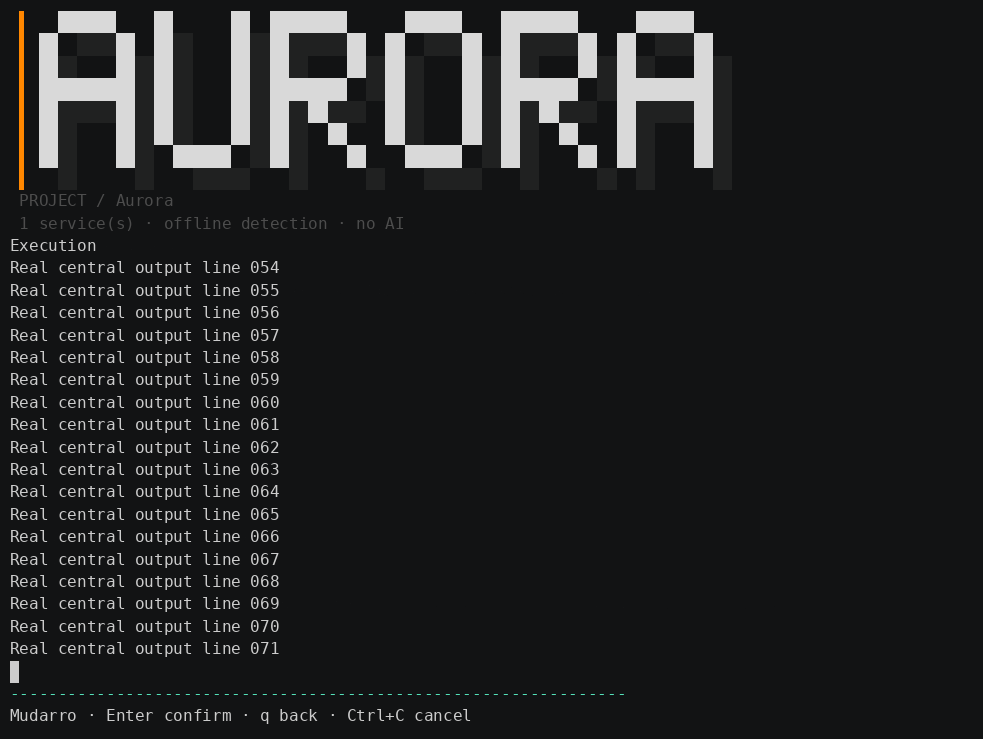
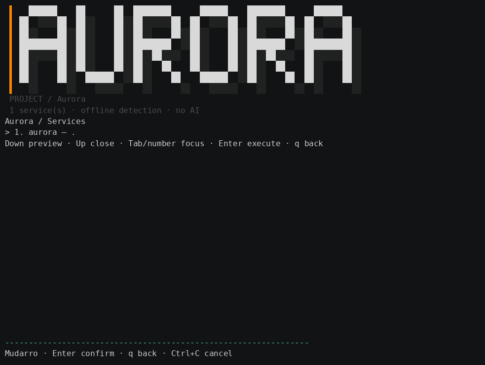
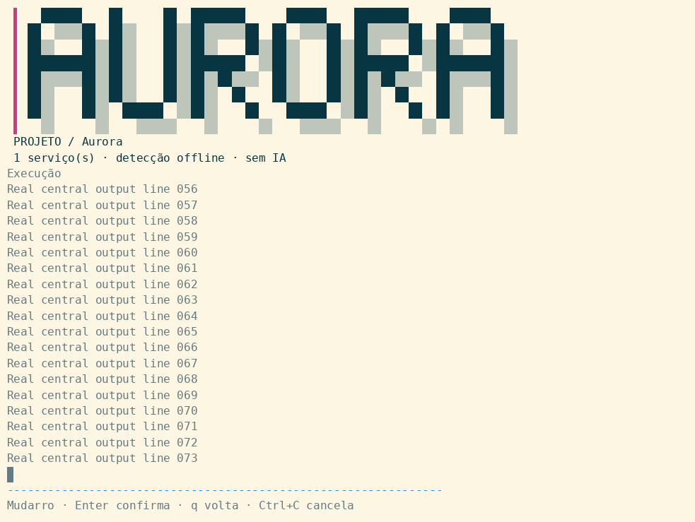
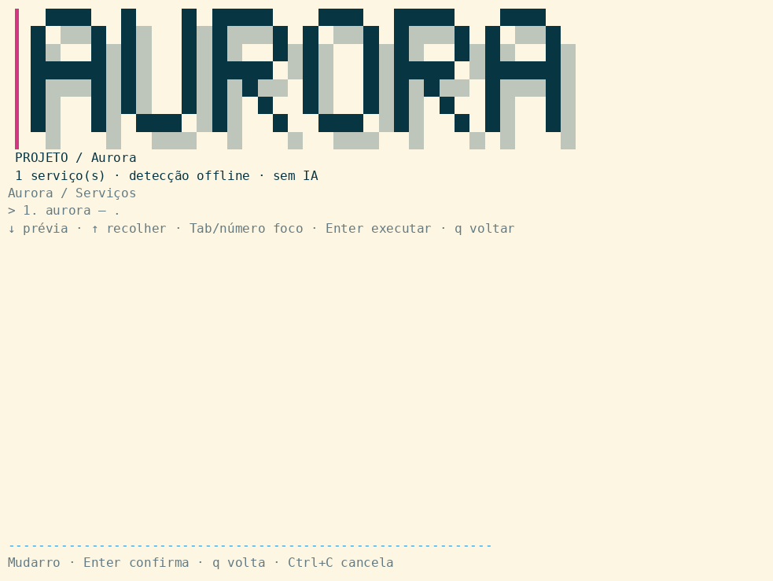

[English](../ui-shell.md) · Português (Brasil)

[Ir para as telas gravadas](#telas-gravadas).

# Moldura permanente do terminal — MUD-032

## Telas gravadas

Execução real do CLI em PTY, com entrada controlada. PNGs são frames renderizados da gravação; não são screenshots do desktop. O banner e o rodapé permanecem fixos enquanto o centro mostra menus, prévia e execução.

**Revisão gravada:** estas telas reais acompanham o shell permanente de MUD-032. As gravações anteriores foram preservadas; a validação abaixo foi executada localmente, independente da CI.

### Escuro · inglês



Frame da saída real longa, com banner e rodapé preservados.



GIF animado da sessão real: prévia, execução, erro, entrada, cancelamento e retorno ao menu.

### Claro · português



Frame da saída real longa, com banner e rodapé preservados.



GIF animado da sessão real: prévia, execução, erro, entrada, cancelamento e retorno ao menu.


Implementado e validado localmente a partir de `9869dc6`. Esta revisão inclui implementação e mídias visíveis; publicação usa `[skip ci]`, sem afirmar nova aprovação de CI. Linux: **86 testes aprovados, sem falhas/skips**, race e vet aprovados. Cobertura: **75,33% (1.866/2.477 statements)** nos pacotes internos, com blocos coverpkg repetidos deduplicados. Smoke, criação/idempotência do menu e regressões da configuração selecionada passaram. Binário e dois pacotes de testes compilaram para Darwin arm64; execução macOS nativa continua não validada. A falha anterior de CI permanece histórica e distinta.

## Frame e capacidades

Menus TTY suportados mantêm header/banner do projeto/footer em serviços, grupos, ações, preview e execução. Contexto inicial do projeto fixo; centro usa posições absolutas do cursor e margens DECSTBM. Resize seleciona layout compacto. Sem altura disponível no centro, Enter não executa. NO_COLOR mantém frame sem cores SGR. Não-TTY, TERM dumb ou dimensão inicial menor que 3×4 usam fallback, sem frame incompatível.

Saída de ações limitada às últimas 256 linhas, máximo 4 KiB por linha. Captura incremental remove todas sequências ANSI antes de apresentar viewport recente. Saída de execução não é viewer interativo de scrollback. TUI genérica não é sandbox nem suporte universal a filhos fullscreen; programas que acessam /dev/tty diretamente podem escapar da captura por pipes.

## Ciclo do filho e entrada

Filhos recebem entrada por pipe, saída no viewport central. Ctrl-C cancela via context e grupo de processos exclusivo: TERM, depois KILL após 300 ms se necessário; WaitDelay 750 ms limita encerramento de pipes herdados. Erros permanecem visíveis até Enter voltar ao menu. SIGTERM externo atualmente cancela ação e retorna ao menu; não representa saída imediata do processo. Estado/margens do terminal restaurados no fechamento e caminhos de retorno. Confirmação destrutiva obrigatória, cancelável antes de executar filho.

## Validação genuína e reprodução

Capturas PTY isoladas escuro-inglês/claro-pt-BR passaram 24 verificações de chrome cada: saída, erro, stdin, confirmação destrutiva explícita preservando entrada colada para o filho, filhos repetidos e restauração. Saída real do aplicativo com entrada PTY controlada, não aceite em emulador físico nem screenshot gráfica do desktop. Destino canônico docs/samples/menu-auto/evidence/ui-shell: profile.cast, pty.txt, metadata.json, GIF e PNG composto. Mídias compartilhadas pelos dois idiomas; GIFs e frames PNG finais já foram inspecionados.

```bash
python3 scripts/record-ui-shell.py /absolute/path/to/mudarro /tmp/mudarro-ui-shell-reproduction
```

Executar da raiz com binário real compilado. Recursos isolados; gravação não abre GUI. Fundo do renderizador é separado da paleta foreground, sem alterar settings do emulador. Testes gráficos visíveis restritos à área 4/tela integrada notebook já confirmadas. Sem integração de família de fonte/instalação.

Resize/NO_COLOR passaram em PTYs 100×32, 12×6 e 8×2; Enter desabilitado sem área central e SIGTERM na navegação restaurou termios, margens e alternate screen. O teste considera coordenadas novas após o reset do resize; bytes já enfileirados para a geometria anterior podem chegar primeiro. GIFs decodificados e frames PNG compostos inspecionados visualmente.

```bash
python3 scripts/validate-ui-shell-resize.py /caminho/absoluto/mudarro /tmp/mudarro-shell-resize
```

Veja [evidências e mídias](../samples/menu-auto/evidence/ui-shell/README.md).
