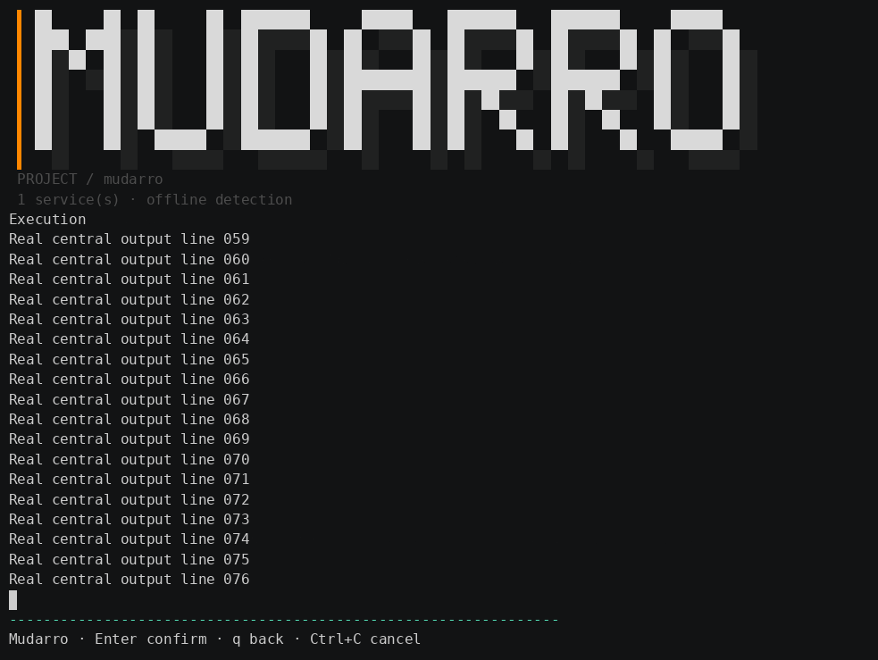
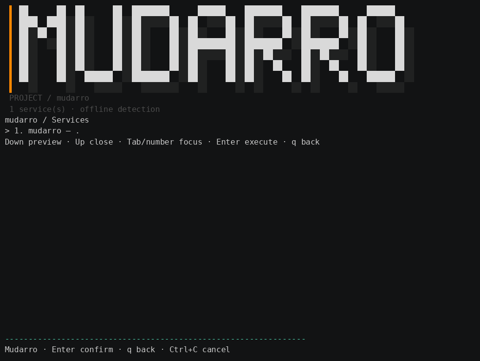
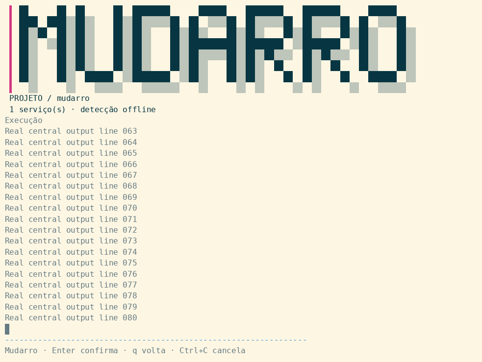
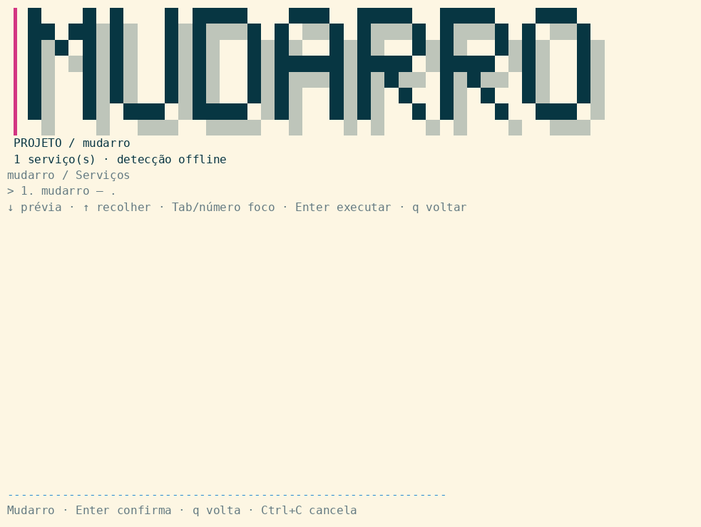

English · [Português (Brasil)](../../pt-BR/samples/menu-auto/README.md)

[Jump to recorded screens](#recorded-screens).

## Current CI correction — MUD-030

Verified [push CI run37416072569](https://github.com/viralabs-dev/mudarro/actions/runs/37416072569), head `bade86e`: completed **failure**. Ubuntu, database and container jobs succeeded; macOS executed and failed in EOF-loop/race-cleanup handling, including panic with index n=-1. Therefore macOS is no longer globally “not executed”: local Darwin cross-compilation passed, but the actual CI runtime failed. Local Podman remains unavailable; container CI passed, distinct from local execution.

Authenticated Actions permissions read returned enabled=true/allowed_actions=all; this does not identify who changed settings. No workflow/config settings, enable action, dispatch or rerun was performed. This corrective commit uses the official [skip ci] marker for the authorized main-only push, honoring the requested no-Actions execution without changing settings. Earlier raw gates/evidence are preserved as historical and superseded for current CI status. Local Linux74-test/76.38% results remain valid for their recorded checkpoint. The portability fix passed 75 local Linux tests with race, vet and Linux/Darwin arm64 compilation. Corrected macOS runtime remains unvalidated; skipping CI does not mean it passed.

# Automatic menu sample

## Recorded screens

Current example: project `mudarro`, supplied by `Config.Name`, with real captures refreshed in MUD-055. This revision publishes the refreshed example based on `246048a`; the earlier Aurora checkpoint remains preserved as history.

Real CLI execution in a PTY with controlled input. PNGs are rendered recording frames, not desktop screenshots. The banner and footer remain fixed while the center shows menus, preview and execution.

**Recorded revision:** these real screens accompany the persistent shell added by MUD-032. Previous recordings are preserved; validation below was performed locally, independently of CI.

### Dark · English



Frame of real long output with the banner and footer preserved.



Animated GIF of the real session: preview, execution, error, input, cancellation and return to the menu.

### Light · Portuguese



Frame of real long output with the banner and footer preserved.



Animated GIF of the real session: preview, execution, error, input, cancellation and return to the menu.


Real outputs from init --select app-javascript:hello and generate, measured 2026-10-06 on personal Pop!_OS24.04, main base049a405a3c19369e92bebfad468e7f36d5ae0db4 with local uncommitted changes. GitHub identity daneiel. Dependency-free Node app.js prints sample ready and stays alive; configuration/menu/wrappers/manifest are actual generated files. Tests copy inputs into a temporary path containing spaces; no install action is invoked.

## Measured behavior

Passed scan JSON/selection, repeated init preserving config, dry-run without writing menu, repeat-generation hashes, launchers from other cwd and space-containing paths, invalid choices/back/exit, real test submenu, hello/test wrappers, supervisor repeated up/status/logs/restart/down, unknown-action failure and manual-edit refusal preserving files. Go regressions cover preflight edited/invalid manifest without partial writes, invalid selection/EOF without saved config, ownership through injected Executor and empty-command panic fix. JS normalized collisions fail baseline and pass fix.

Go/race/vet and package contract tests passed; recorded aggregate1,028/1,427 statements=72.04%. See [coverage](../../coverage.md), [support](../../support-matrix.md), [architecture](../../architecture.md), [roadmap](../../language-roadmap.md). The final migration gate is recorded below.

Installer simulation, Docker Compose/Dockerfile, offline Docker --network none, kind manifests/kustomize and Helm passed. Eight DB combinations passed existing-dependency mode; seed hooks are not row-insertion proof for Goose/Prisma. Mounted PVC Bound/sameUID/content after down/up/restart proved fixture-cycle persistence; initial Pending fixture did not. Resources exclusively owned by tests were removed. Native PostgreSQL/Podman and macOS/WSL unavailable; Yarn/uv/poetry runtime absent. Existing pnpm real E2E passed.

## Evidence and media

Evidence remains only in this directory, shared by both documentation languages. menu-session.txt/.timing records genuine CLI E2E ending Automatic menu end-to-end: OK. go-tests/vet and v2 logs retain earlier stages; packages-final-tests.txt/packages-vet.txt/packages-coverage.out/functions/summary record package round. packages-menu-real/languages-real/pnpm-real/containers/dockerfile/kustomize/helm/databases logs record executed integrations. packages-collision-before.txt is expected baseline failure; packages-collision-after.txt passes. parallel-review.txt records independent review.

visual-session.* is genuine paced PTY output converted to cast and rendered using authorized official agg1.9.0 under /tmp without sudo. menu-real-v2.gif and later evidence/packages-visual/ retain real recordings; GIF decode/composed frames checked. Earlier v1 assets retained. frame-menu-v2-recording.png and package frame are composed recording frames, **not graphical screenshots**. Earlier v2 media measured983×739/7frames/15.04s; consult per-recording validation logs for final media.

CUA exposed no apps/browsers; graphical portal capture was cancelled. Visible execution belongs only to already-confirmed workspace4/integrated notebook screen. No repeated position request, no portal reopening without request. PNG screenshot remains pending; user visual design acceptance has been received; headless recording opens no desktop window. No unrelated personal content or synthetic imagery captured.

## Reproduction

Requirements: Go build tool, Bash, Node/npm, realpath/sha256sum/find/cmp/ps. Preserve generated sample; validate-menu uses an isolated copy and cleans only its own resources. Integration scripts require their own installed tools and isolated runtime resources. Existing-dependency DB mode requires matching available dependencies; without it the original runner installs packages and needs corresponding authorization. PostgreSQL17 container does not validate host-native PostgreSQL.

Final v4 demo command:

```bash
env -u NO_COLOR TERM=xterm-256color bash /tmp/mudarro-checkpoint-v4/scripts/demo-menu.sh /tmp/mudarro-checkpoint-v4/bin/mudarro
```

Temporary snapshots may disappear; rebuild and use scripts/demo-menu.sh with an absolute binary path. Choose1 service,4 quality,1 test,Enter,0 return; q returns/exits. NO_COLOR is removed only in the demonstration child, not globally. v4 binary SHA25676ccc665970c48a7f7c95f9a9052599cd23aee4580060b11a265a5b1bd91d942. Previous snapshots preserved. Infra/DB used extraction snapshot b21c91f; later changes were JS collision/named fields, with final suites and language E2Es rerun. CI reference37405606285 at f62ce9d predates these changes; no push/merge/deploy.

## Existing reproduction examples

Commands and configuration identifiers are preserved verbatim; Portuguese comments and user-supplied example values are intentionally retained.

```bash
GOCACHE=/tmp/mudarro-go-cache /home/danielsouza/sdk/go1.27.1/bin/go build -o /tmp/mudarro-validation-bin/mudarro ./cmd/mudarro
bash scripts/validate-menu.sh /tmp/mudarro-validation-bin/mudarro
```

```bash
scriptreplay -T docs/samples/menu-auto/evidence/menu-session.timing \
  -O docs/samples/menu-auto/evidence/menu-session.txt
```

```bash
env -u NO_COLOR script -q -e -O docs/samples/menu-auto/evidence/visual-session.txt \
  -T docs/samples/menu-auto/evidence/visual-session.timing \
  -c 'bash scripts/record-menu.sh /tmp/mudarro-validation-bin/mudarro'
python3 scripts/typescript-to-cast.py
/tmp/mudarro-media-tools/agg --font-family 'DejaVu Sans Mono' --font-size 16 \
  --theme github-dark --fps-cap 10 --last-frame-duration 3 \
  docs/samples/menu-auto/evidence/visual-session.cast \
  docs/samples/menu-auto/evidence/menu-real.gif
```

```bash
env -u NO_COLOR TERM=xterm-256color bash /tmp/mudarro-checkpoint-v3/scripts/demo-menu.sh /tmp/mudarro-checkpoint-v3/bin/mudarro
```

```bash
PATH="/tmp/mudarro-test-tools:$PATH" \
MUDARRO_PYTHON_ENV=/tmp/mudarro-prisma-debug/python-env \
MUDARRO_JS_DEPS=/tmp/mudarro-prisma-debug/js-deps \
bash scripts/validate-databases.sh /tmp/mudarro-checkpoint-v2/bin/mudarro
```

```bash
PATH="$HOME/.local/bin:$PATH" bash scripts/validate-kind.sh /tmp/mudarro-checkpoint-v2/bin/mudarro
PATH="$HOME/.local/bin:$PATH" bash scripts/integration-helm.sh /tmp/mudarro-checkpoint-v2/bin/mudarro
```

```bash
env -u NO_COLOR TERM=xterm-256color bash /tmp/mudarro-checkpoint-v4/scripts/demo-menu.sh /tmp/mudarro-checkpoint-v4/bin/mudarro
```

## Final test-tree gate — 2026-10-06

All 41 tests passed with race and explicit internal coverpkg instrumentation after relocation. Deduplicated coverage: **1,035/1,427 statements = 72.53% (Go displays 72.5%)**; previous 1,028/1,427=72.04% remains historical. Vet, Linux build, Darwin arm64 terminal-test cross-compilation and diff check passed. Darwin compilation is not macOS runtime. Test tree contains 16 files (nine orchestration test files plus one helper; two terminal test files plus four PTY helpers). No test hooks or overlays added to production.

Evidence: [test-tree-tests.txt](evidence/test-tree-tests.txt), [test-tree-coverage.out](evidence/test-tree-coverage.out), [test-tree-coverage-functions.txt](evidence/test-tree-coverage-functions.txt), [test-tree-coverage-summary.tsv](evidence/test-tree-coverage-summary.tsv), [test-tree-gates.txt](evidence/test-tree-gates.txt).

## Consumer project identity — MUD-022

The menu title is the consumer project `Config.Name`, not the Mudarro tool name. The controlled sample now uses Aurora (package/config); demo and recording default explicitly to Aurora, overridable with `MUDARRO_SAMPLE_NAME`. The existing CLI already used Config.Name; demonstration inputs were corrected. User visual design acceptance has been received; only the genuine graphical screenshot remains pending.

Text sanitization strips controls and Unicode Cf formatting characters. Conservative terminal-cell estimation counts CJK/fullwidth/emoji as two cells and combining marks as zero; it is not a complete grapheme/terminal-width guarantee. Unsupported bitmap glyphs or an excessively long wordmark fall back to readable text instead of presenting an incorrect identity.

The current name stage has 43 Test functions and 24 rich/narrow/plain/NO_COLOR name-mode cases, covering AtlasAPI, Aurora, Café, 漢字😀, long names and control injection, plus explicit consumer-name CLI integration. Race passed; the final coverage and build gates passed as recorded below. Previous stage coverage remains historical. Genuine latest media belongs in `evidence/project-name-visual/` under the canonical sample; `evidence/packages-visual/` remains historical.

## Current consumer-name validation — MUD-022

43 Test functions passed with race, including 24 consumer-name/mode cases. Vet, Linux build, Darwin arm64 terminal-test cross-compilation and Bash syntax passed. Coverage: **1,063/1,451 statements = 73.26% (Go displays 73.3%)**, 388 unexecuted. Prior MUD-017 1,035/1,427=72.53% is historical; changed code and denominator preclude interpreting the difference as equivalent requirement coverage. macOS runtime was not exercised in this historical local stage; current CI runtime failed as recorded above.

Real final GIF: 983×739, 8 frames, 15.04 s. Composed frame inspected: AURORA lettering and PROJETO / Aurora. This is a real PTY recording frame, not the still-pending graphical screenshot. User design approval received. Binary SHA-256: `ef36e6c1142bd7294e543208895cea21e125c6898d14ec168e40c1c7eb327890`.

Evidence: [project-name-tests.txt](evidence/project-name-tests.txt), [project-name-coverage.out](evidence/project-name-coverage.out), [project-name-coverage-functions.txt](evidence/project-name-coverage-functions.txt), [project-name-coverage-summary.tsv](evidence/project-name-coverage-summary.tsv), [project-name-vet.txt](evidence/project-name-vet.txt), [project-name-visual/frame-menu-recording.png](evidence/project-name-visual/frame-menu-recording.png).

Current consumer-name demo checkpoint: `/tmp/mudarro-checkpoint-v5`; earlier checkpoints remain.

```bash
env -u NO_COLOR TERM=xterm-256color bash /tmp/mudarro-checkpoint-v5/scripts/demo-menu.sh /tmp/mudarro-checkpoint-v5/bin/mudarro
```

## Current configurable UI recordings

Final checkpoint:74 tests;1,552/2,032=76.38% aggregate statements (Go76.4%),480 uncovered; terminal379/422=89.81%. Race/vet/Linux/Darwin cross-build and real UI/language/pnpm/Dockerfile/database gates passed. Binary SHA-256: `260fb0f6703fda29ef02040a0e4e691e5c3a3233f908f5f1bd89fd27d67e4053`. Historical stages remain preserved.

Genuine preview recordings: dark English983×739/17frames/12.90s; light pt-BR983×739/16frames/12.90s. Cast elapsed output9.917s; renderer adds final-frame duration. Composed frame labels were inspected. Injected PTY keyboard/mouse events exercise parsing; no actual-emulator mouse acceptance or graphical screenshot claimed. Nonexecuted long-script fixtures: canonical sample aurora-dark-en and aurora-light-ptbr directories. Preview never runs those scripts; fixtures assert SHOULD_NOT_EXECUTE absent.

Reproduce in an isolated temporary output directory, using the actual built binary:

```bash
python3 scripts/record-ui-preview.py /absolute/path/to/mudarro /tmp/mudarro-ui-preview-reproduction
/tmp/mudarro-media-tools/agg --theme asciinema \
  /tmp/mudarro-ui-preview-reproduction/aurora-dark-en.cast \
  /tmp/mudarro-ui-preview-reproduction/aurora-dark-en.gif
/tmp/mudarro-media-tools/agg --theme solarized-light \
  /tmp/mudarro-ui-preview-reproduction/aurora-light-ptbr.cast \
  /tmp/mudarro-ui-preview-reproduction/aurora-light-ptbr.gif
```

Run from repository root. agg is the previously authorized temporary renderer; commands assume it remains available. Backgrounds come explicitly from renderer themes asciinema/solarized-light to demonstrate intended foreground palette contrast. The application does not change emulator background or global settings.

[aurora-dark-en.gif](evidence/ui-configuration/aurora-dark-en.gif), [aurora-light-ptbr.gif](evidence/ui-configuration/aurora-light-ptbr.gif), [frame-dark-en.png](evidence/ui-configuration/frame-dark-en.png), [frame-light-ptbr.png](evidence/ui-configuration/frame-light-ptbr.png), [languages-real.txt](evidence/ui-configuration/languages-real.txt), [pnpm-real.txt](evidence/ui-configuration/pnpm-real.txt), [databases-real.txt](evidence/ui-configuration/databases-real.txt).
