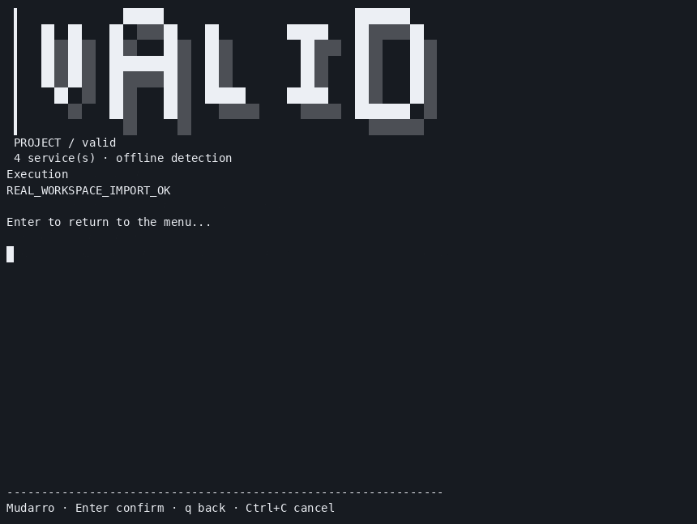
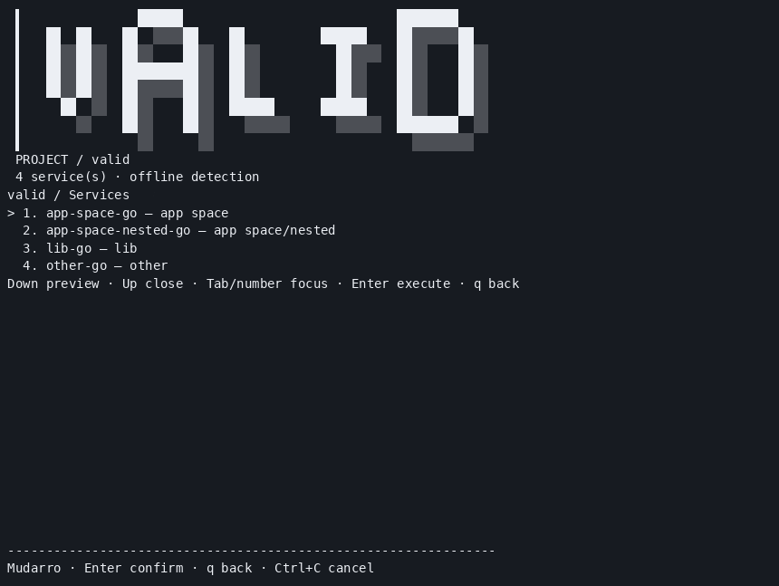

# Official Go workspace parser — integrated local evidence

**165 race PASS (162 substantive groups + three isolated helpers), 0 FAIL/SKIP; 2199/2746 = 80.08%.** [Summary](summary.json), [test events](tests.jsonl), [coverage](coverage.out). Module verification, vet, Linux build, Darwin arm64 cross-build, smoke, menu/configuration and six genuine PTY resize variants passed. Native macOS was not executed. Final Linux binary SHA256 `c926247ab2c47f24aa4124ba934cffd02f90bb534b12fd6550b99c246a0fdf60`; base b887f64; new work remains local, uncommitted and unpublished.

## Real flows and test matrix

| Flow | Actual result / evidence |
| --- | --- |
| Official parser; quoted paths/comments/use blocks; version/toolchain/replace metadata | Nine parser groups /14 subcases pass with fresh race run; [summary](tests/summary.json), [fresh output](tests/after-followup-fresh.txt) |
| Missing/invalid member go.mod, missing declaration, syntax, outside-root relative/absolute paths, symlinks, duplicate directory/module names | Precise warnings preserve independent services; baselines and negative results retained in [tests](tests/README.md) |
| Regular-file4MiB bound, FIFO, scan excludes/ignored directories before member reads | Bounded/static checks pass; excluded entries explicitly unvalidated; isolated FIFO helpers joined without watchdog timeout |
| Scan remains offline without executing Go | Trap-executable regression passes; module/toolchain/replacement resolution remains a runtime responsibility |
| Real Go workspace import, inherited context and explicit off | [21 real checks](runtime/after-summary.json) pass, including expected import failure with off; actual wrapper and supervisor run, generated hashes/manual config preserved, owned service stopped |
| Final binary recheck | [Real Go scan/import/test](go-recheck.json) and [all five installed runtime scans/quality actions](runtime-recheck/summary.json) pass |
| Distribution and installer | [Four actual cross-built archives](release-local-summary.json) contain notices/licenses; [installer fixture tests](installer-final.txt) pass legacy/new/repeat/partial/corrupt/symlink/preservation cases |

Members are syntactically valid root-contained modules, not a promise that the workspace executes. Distinct directories declaring the same module remain listed with an explicit conflict warning; Go rejects that workspace. Canonical duplicate paths are warned/deduplicated. Excluded members appear separately and are not read/validated. No JS/Go inheritance, aggregate orchestration, packageManager provisioning, imported-module graph, replacement target or toolchain compatibility is inferred.

## Genuine recording and saved sample





[Original cast](runtime/workspace-menu.cast) and [PTY bytes](runtime/workspace-menu.pty.txt) record real execution with `REAL_WORKSPACE_IMPORT_OK`. The GIF was decoded completely:15 frames,860×647; PNG is frame7 composed from that recording and visually inspected. [Validation](runtime/media-validation.json). Headless PTY input was injected into the real application; these are terminal recording frames, not graphical desktop screenshots. No browser was used. Original recording binary SHA256 `0e3e43f4b8cff5218b4e174c0a9d683155da3490994c6fbe698e2dbfefcad193` predates the last exclusion/conflict diagnostic refinements; final-bin rechecks above verify actual unchanged positive runtime paths without relabelling the recording.

[Saved real workspace sample](sample/go.work) includes app space, library, independent module, nested module, explicit config and generated menu/wrappers. Binary, caches, transient supervisor state and personal content are excluded. Reproduce in a fresh copy; never overwrite the source sample:

```bash
# From the repository root, using an existing Go SDK on PATH:
go build -o /tmp/mudarro-workspace-demo ./cmd/mudarro
fixture_dir=$(mktemp -d /tmp/mudarro-workspace-demo.XXXXXX)
cp -R docs/samples/menu-auto/evidence/go-work-parser/sample/. "$fixture_dir/"
GOPROXY=off GOTOOLCHAIN=local GOFLAGS=-buildvcs=false /tmp/mudarro-workspace-demo scan --root "$fixture_dir" --json
GOPROXY=off GOTOOLCHAIN=local GOFLAGS=-buildvcs=false /tmp/mudarro-workspace-demo run app-space-go:probe --root "$fixture_dir"
GOPROXY=off GOTOOLCHAIN=local GOFLAGS=-buildvcs=false /tmp/mudarro-workspace-demo menu --root "$fixture_dir"
```

Select app-space-go → probe to see the cross-module marker. Existing [selection/context contract](../manager-go-decisions/README.md) preserves inherited go.work by default and supports explicit go_workspace:off. Selection promotes one Go entry to commands.start, preserving existing manual configuration. Strict SemVer version syntax remains as documented there.

## Dependency integrity and packaging

Authorized project dependency `golang.org/x/mod v0.25.0` is pinned in go.mod/go.sum, compatible with the project Go1.23 minimum; official proxy/SumDB verification is saved in [download metadata](dependency-download.json). No new Go SDK or global tool installation. [Module verification](mod-verify-retry.txt) passes. The first offline attempt lacked metadata for the existing YAML test dependency; only already-cached check.v1/x.tools .mod/.info metadata was copied read-only into the private cache to recover, without downloading/installing global tools. [Original failure](mod-verify.txt).

[Official parser source](https://github.com/golang/mod/blob/v0.25.0/modfile/work.go) · [Module tag](https://proxy.golang.org/golang.org/x/mod/@v/v0.25.0.info) · [SumDB record](https://sum.golang.org/lookup/golang.org/x/mod@v0.25.0).

[Third party notices](../../../../../THIRD_PARTY_NOTICES.md) and LICENSES preserve the three direct compiled dependency licenses. Release archives include these files; the installer preserves legacy binary-only archives and stores new notices under its target `mudarro-licenses/` directory. Tests use private fixtures/fake download transport, not a published install. Archives were built under a private /tmp source copy, not released. Binary replacement is atomic separately; binary plus notices are not a single transaction and later filesystem copy failure may leave a partial update. Cross-builds do not prove native Darwin/arm64 execution.

Per-file4MiB reading is not an aggregate memory cap; existing stat/open filesystem races remain. Real dependency/framework-heavy projects, native macOS, WSL, native PostgreSQL, local Podman and physical emulator/mouse/desktop capture remain separate environment/acceptance limits. [Artifact hashes](SHA256SUMS.json) permit integrity checking; no secrets, module cache, environments or transient process state are included.
