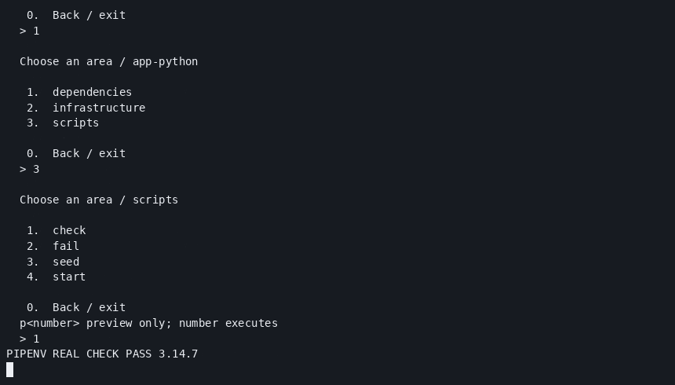
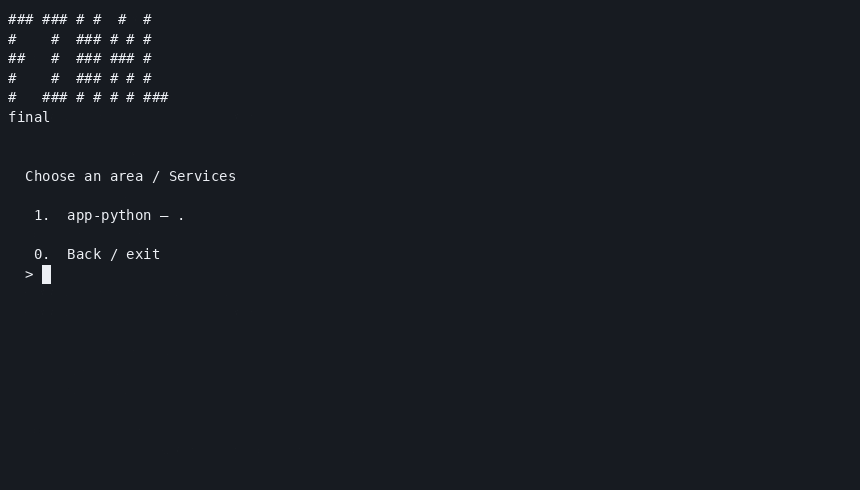
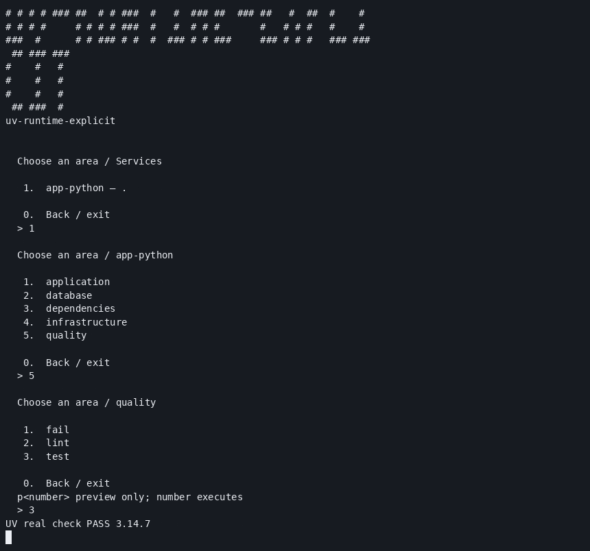
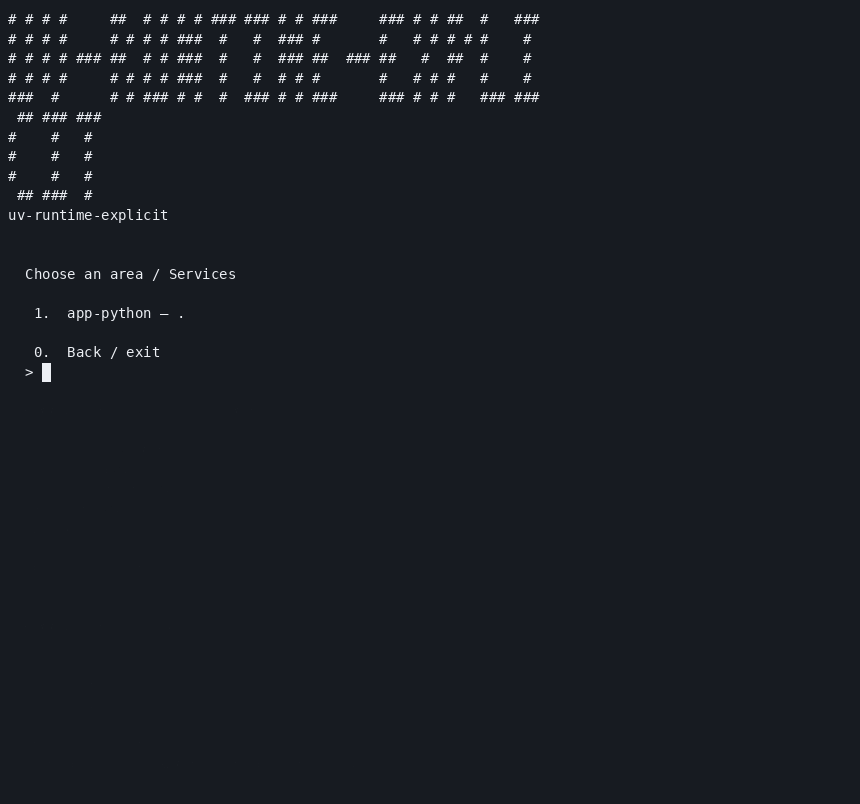
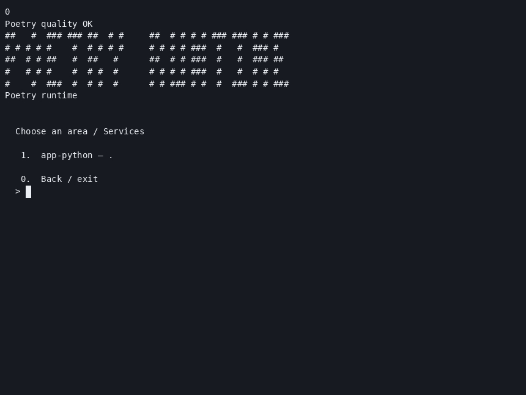
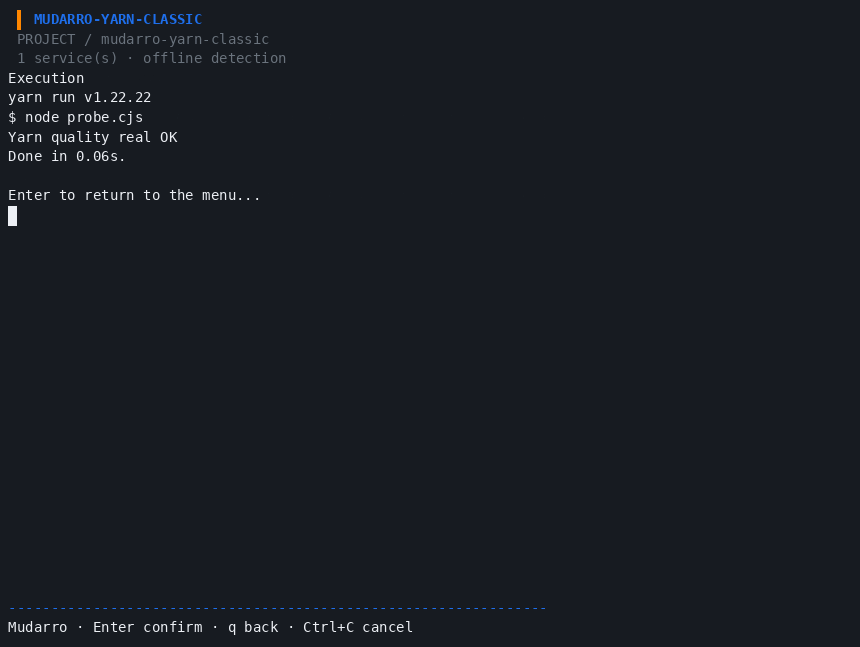
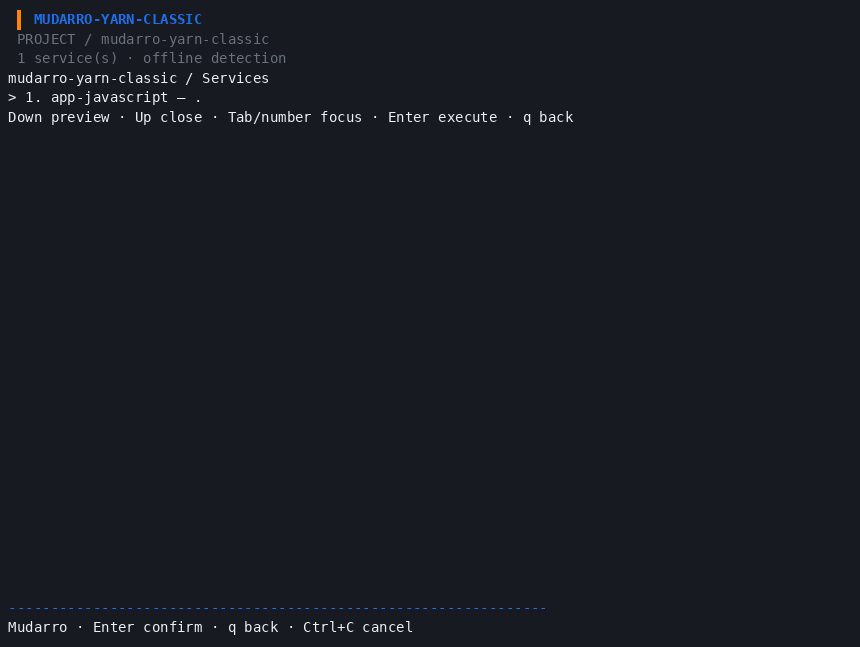
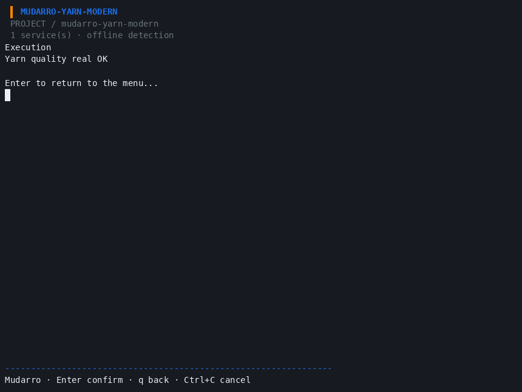
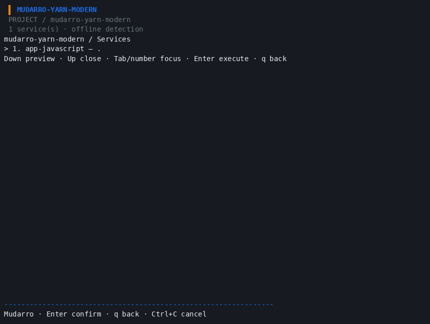

# Authorized isolated runtime validation — MUD-034/047/048/049

User approved pinned installations in a fresh temporary root, `/tmp/mudarro-runtimes.K7F4J1`, on 2026-10-06. Separate tool venvs, official wheelhouses, caches and fixtures were used; no sudo, global install, shell-profile change, new Python or new Corepack. Nine Pipenv wheels, 45 Poetry wheels and one uv wheel were checked against official PyPI SHA256 metadata and installed offline with `--require-hashes`. Yarn Classic/Modern verification is recorded separately. Top-level versions are fixed; resolved transitive versions and hashes are preserved in each installation directory.

| Runtime | Real version | Covered | Limits |
|---|---|---|---|
| Pipenv | 2026.8.0 | real lock/install/sync/scripts, scan/init, generation twice, wrappers/menu, lifecycle, controlled failure, repeated custom SQLite seed | scripts/start explicitly selected; full Pipfile schema/hash semantics and frameworks not validated |
| uv | 0.12.23 | offline real lock/sync/run, scan/init, generation twice, wrappers/menu, lifecycle, malformed manifest warning, controlled failure, repeated custom SQLite seed | explicit start/custom scripts; no package build backend or ORM/framework |
| Poetry | 2.5.1 | real lock/env/install/run, scan/init, generation twice, wrappers/menu, lifecycle and preservation negatives | package-mode=false, explicit start/test; no framework or database seed needed |
| Yarn Classic | 1.22.22 | see separate Yarn evidence | zero-dependency Node application, no workspace claim |
| Yarn Modern | 4.18.1 | see separate Yarn evidence | node-modules linker; no PnP/workspace claim |

All fixtures use existing interpreters and no third-party application dependencies. These results do not prove arbitrary dependency resolution/builds, macOS/WSL, native PostgreSQL, Podman or full ecosystem support. A child failure remains nonzero through Mudarro (CLI exit1 reports the child exit code). Initial helper mistakes are preserved and explained in summaries; no production defect was inferred from a fixture/navigation error. All fixture applications were stopped.

For this original runtime checkpoint, production code and binary stayed at the previously verified [143 race PASS checkpoint](../doctor-compose-timeout/README.md): 141 substantive groups + two isolated helpers, zero fail/skip, 79.08%. That suite was not rerun merely for artifact changes. These are additional real runtime validations, not additional unit-test counts.

## Genuine recordings

These PNGs are frames decoded from actual PTY GIFs. They are not graphical desktop screenshots. Only owned fixture output was captured; no browser was used. Keyboard input was injected and logged. GIF frames were decoded using Go's standard image/gif decoder; rendered frames were inspected for useful action output. Poetry's typescript contained one timed output chunk, so its recorded frame/cast is supplied without claiming useful animation.

### Pipenv menu executing check

[Cast](pipenv/logs/check.cast) · [runtime summary](pipenv/logs/summary.json) · [sample](pipenv/sample/Pipfile).

### uv menu executing test

[Cast](uv/logs/runtime-menu.cast) · [runtime summary](uv/logs/summary.json) · [sample](uv/sample/pyproject.toml).

### Poetry probe and generated menu

[Original typescript](poetry/logs/session.txt) · [timing](poetry/logs/session.timing) · [converted cast](poetry/logs/session.cast) · [summary](poetry/logs/summary.json) · [sample](poetry/sample/pyproject.toml).

## Reproduction

Saved samples include real manifests, locks, configuration and generated wrappers. Venvs, package binaries, caches, application databases, supervisor state and fixture dotenv are excluded. Copy sample sources/config into a new private fixture, supply exactly the approved tool/interpreter versions with subprocess-scoped PATH/cache settings, then run scan/init/generate and the listed actions. The archived final menu intentionally contains the preservation probe's manual edit; regenerate into a fresh fixture rather than using it as a pristine ownership baseline. The generated wrappers invoke Mudarro via PATH: include the directory containing the verified binary.

Installation reports, hashed requirements, official metadata, actual command logs and helper scripts are archived per tool. Helpers retain original exclusive temporary paths and must be adapted to a fresh owned root before replay; do not execute them against the project checkout or another user's directory. The tools currently remain only in the authorized temporary root and may disappear on reboot. Reinstalling into a new environment still requires the approved scope; this approval does not permit arbitrary new tools or versions.

### Yarn Classic menu executing test

### Yarn Modern menu executing test

[Runtime matrix](yarn/logs/e2e-summary.json) · [verified installations](yarn/logs/install-summary.json) · [reproduction](yarn/logs/REPRODUCTION.md) · [Classic sample](yarn/classic/sample/package.json) · [Modern sample](yarn/modern/sample/package.json).

Classic ran with existing Node26.7.0; Modern's shim/fixture ran with existing Node24.15.0 and reused Corepack0.34.6. Modern disables network during runtime, while Classic's initial install used offline mode but network was not explicitly disabled for every generated runtime install. No application dependencies were declared. `--frozen-lockfile` was accepted by Modern with a deprecation warning; the generated Mudarro action uses plain `yarn install`, so no production flag fix was needed. PnP/workspaces/external dependencies are untested.

Classic's initial capture warned about global-prefix fallback including `~/.yarn`; explicit private prefix/global-folder/cache settings removed this warning on rerun. The named home path is absent now, but there was no prior baseline, so absence of historical writes is not claimed. No home scan or cleanup was performed. Unrelated inherited PATH/session details were omitted from archived environment JSONs; raw controlled logs retain the observed warnings.

Subsequent authorized manager/Go fixes have a new [156-test code checkpoint and current-binary runtime recheck](../manager-go-decisions/README.md). Original recordings/locks remain preserved; do not confuse their binary hash with the newer one.

## Final integrated binary recheck

All five real scans and quality actions passed again on the final165-test/80.08% binary. [Current integrated result](../go-work-parser/README.md) and [per-runtime results](../go-work-parser/runtime-recheck/summary.json). Original full-flow media and hashes remain historical and are not relabelled.
