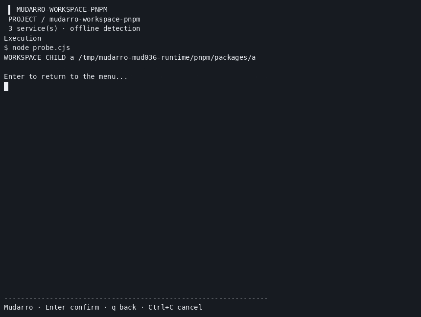
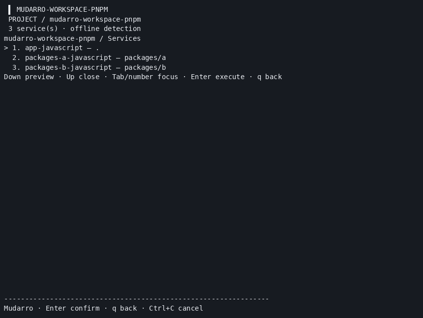

# JavaScript workspace ownership — MUD-036

**176 race PASS (173 substantive groups + three isolated helpers), 0 FAIL/SKIP; 2381/2945 = 80.85%.** [Summary](summary.json), [events](tests.jsonl), [coverage](coverage.out). Mod verify, vet, Linux build, Darwin arm64 cross-build, smoke, menu/configuration and actual PTY resize pass. Final binary SHA256 `f7ad58a06507516a0d97de1ffb8efd561ff0cb17240b3cb15649743b940d341c`. MUD-036 changes are local on published44c4e04; no new commit/push/Actions for this change.

## Confirmed contract

Only the declared root manager is inherited. Each member keeps its own scripts, service directory/cwd, infrastructure and database evidence. No root command/start/infra/database/environment inheritance. The root owns the automatically generated package-manager install action; members have no automatic install. Root and members remain distinct services without duplication. `workspace_root` is declarative ownership metadata; manual config/commands override through the existing no-overwrite workflow.

Roots use package.json workspaces array or packages-array object, or pnpm-workspace.yaml packages. Equivalent dual declarations (same pattern set) are one pnpm ownership; divergent declarations retain unresolved ownership and suppress automatic executable commands/suggestions for candidates. A pnpm declaration without manager/lock selects pnpm. Invalid root manager or ambiguous locks preserves unresolved member ownership rather than falling back to npm. Explicit incompatible member manager/lock or exact version is pending, requiring explicit configuration; compatible declarations pass. Version metadata remains syntax-only as in MUD-035, no provisioning/hash enforcement.

Nested declarations own their nearest matched children. An inner root overlapping an outer declaration with a conflicting manager remains pending; its own declared descriptor retains child ownership. Unresolved inner roots preserve conflicts rather than producing empty-executable suggestions. Installation occurs at each independently declared root. Root replacement/generic build graph/Turbo/Nx/PnP orchestration is not inferred.

## Coverage and genuine execution

| Flow | Result |
| --- | --- |
| Manager-only inheritance, root installation, own scripts/cwd, independent infra/DB | [11 fresh race groups/20 subcases](tests/summary.json) PASS |
| Globs, negations, scan exclusions, nearest nested boundary, symlinks and offline executable traps | PASS; scan does not execute managers/plugins |
| Manager/version/lock conflicts; equivalent/divergent sources; invalid root and unresolved nested root | Before/fix logs preserved in tests; final PASS |
| Manual config/hash preservation | Existing init does not overwrite; scan preserves sources |
| npm11.19.0, pnpm11.3.0, YarnClassic1.22.22, Modern4.18.1, Bun1.4.0 | [85 actual CLI checks](runtime/after-summary.json) across5managers PASS; root install, child test/custom script/wrapper/menu, supervisor lifecycle/down, generate twice, rejected member install and existing init |
| Actual conflict scans | Two negatives explicitly suppress executable member plans |
| Final binary | [All five scan/child-test rechecks](runtime-recheck.json) PASS |

Zero third-party application dependencies; existing/pinned approved runtimes only, no new manager installation. Initial Bun tempdir EROFS and pnpm default-store SQLite failures were recovered with private subprocess-scoped directories and recorded, without global/security changes or personal cleanup. These scoped failures are not hidden runtime passes.

## Actual recording and samples

[Original cast](runtime/workspace-child-menu.cast), [PTY bytes](runtime/workspace-child-menu.pty.txt), [record validation](runtime/workspace-child-menu-validation.json).88 output events, exit0, termios restored; fresh child marker confirms actual cwd. GIF fully decoded15frames860×647, PNGframe7 visually inspected showing WORKSPACE_CHILD_a and packages/a cwd; [media validation](runtime/media-validation.json). Headless PTY input was injected into the real app; no browser or desktop screenshot. Recording/full runtime precede only the last conflict-diagnostic refinements; final-bin recheck is separate, with hashes retained.

177 real sample files are saved under samples/npm, pnpm, classic, modern and bun; exclude node_modules/stores/caches/tempdirs/process state/env/binaries. [npm sample](samples/npm/package.json), [pnpm declarations](samples/pnpm/pnpm-workspace.yaml), [reproduction](reproduction.md). Copy into a fresh owned temporary directory; archived helper paths must be adapted before execution. Generated config/menu may contain preservation markers; regenerate into a new fixture rather than treating this as a pristine ownership baseline.

## Parser and remaining limits

Supported patterns: per-segment `*`, `?`, character classes, full-segment `**`, leading `!` exclusions; negatives exclude independent of order. Matching uses the safe scanned package.json inventory, respects scan excludes/ignored dirs/symlinks, and never follows filesystem glob tools. Patterns exceeding4096bytes/128segments, braces/extglobs/backslashes/absolute/outside paths are diagnosed; no full npm/pnpm glob equivalence promise. If declaration syntax or pattern parsing is invalid and membership cannot be determined, the warning is explicit and packages remain independently detected; ownership is not guessed. Per-file4MiB and existing stat/open race limitations remain. No imported package graph, frameworks, manager version enforcement, Turbo/Nx or native macOS/WSL/Podman/physical acceptance claim.

## Previously authorized publication

The prior165-test batch was published normally to main as [44c4e04](https://github.com/viralabs-dev/mudarro/commit/44c4e04016038fe6f8241951568f6ec7de1470a0), author/committer both daneiel. [API proof](publication-165/github-commit.json), [push](publication-165/push.txt), [first](publication-165/actions-first.json)/[second Actions checks](publication-165/actions-final.json): zero observed runs, not CI success. Trees matche0f393ebe6bc1492aecb03381689c4f96513e727. Exactly671allowlisted files committed, temporary provider-after.pid excluded/preserved. Existing *.log ignore rules left some archived raw logs local, outside that exact approved allowlist; sources/media/summaries were published. Raw logs remain local; the minimal next proposal includes [15 representative genuine outputs](runtime/command-evidence.json) in structured form, full85check results and final-bin outputs, without forcing ignored logs into Git. Current SHA256SUMS covers the selected public subset; the full local manifest is preserved in /tmp/mudarro-mud036-publication/javascript-full-local-hashes.json. MUD-036 is a separate unpublished change.
