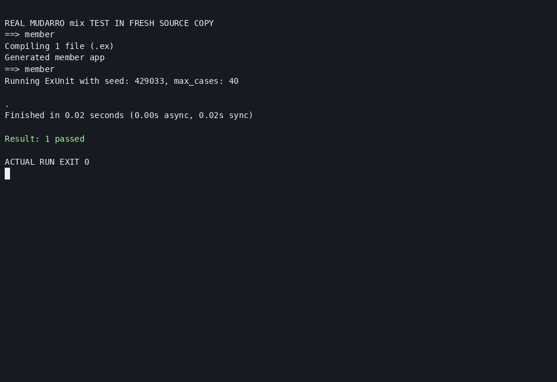
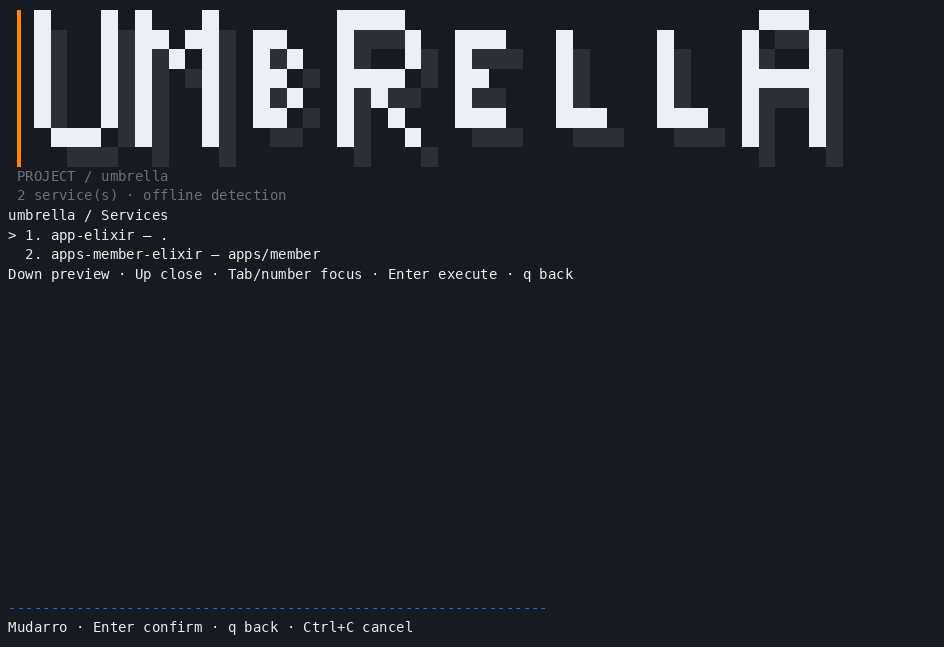
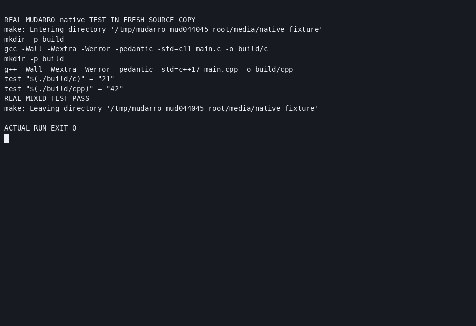
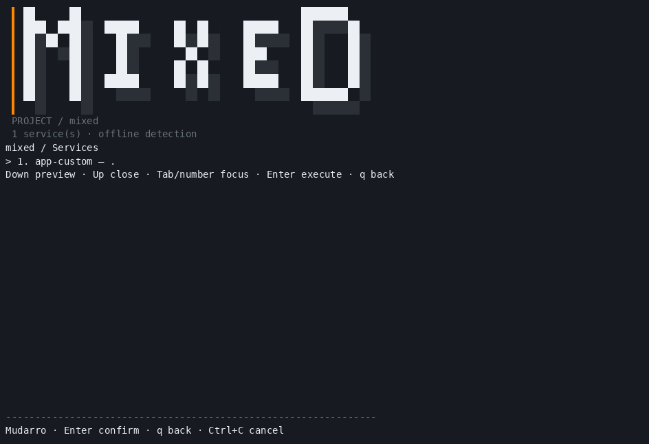

# MUD-044/MUD-045 — Mix e Make nativo explícitos

**199 testes race PASS, zero falhas/pulados; cobertura2634/3223=81,73%.** Vet, buildLinux/crossDarwinarm64, smoke, menu/configuração e resizePTY PASS. [Resumo](summary.json), [eventos](test-results.json), [matriz completa](README.md). Binário SHA118b9c03628481fd3bf662c1590a036e0ec812d744d59055d23983bdd3a5aef4. Adaptadores locais sobre6c868c95, sem publicação deste lote.

Mix detecta mix.exs regular/limitado4MiB sem avaliar ou interpretar código. Compile/test são sugestões opt-in; nenhum start/install/deps inventado. mix_umbrella:true precisa declaração manual de serviço Elixir/Mix e manifesto regular; metadado explícito, sem grafo/membros/herança inferidos. Mix executa umbrella no runtime conforme projeto do usuário. deps/_build ignorados somente junto ao manifestoMix regular nãoexcluído; workspaceJS legítimo preservado após regressão reproduzida/corrigida.

C/C++ usa evidências de fontes .c/.cpp/.cc/.cxx e headers .h/.hpp regulares, sem ler conteúdo. Serviço custom associado ao Make mais próximo ou diretório de fontes; owner de linguagem existente preservado. Headers sozinhos não criam serviço. TargetsMake selecionados ou comandos configurados pelo usuário; sem flags/start/compilador inventados. Sem Make, evidência pending/sem comandos. Arquivos Make/shell órfãos diagnosticados, sem owner arbitrário. CMake/Meson fora.

26checksMix reais root/umbrella+8rechecks finais;63comandosC/C++/misto/source-only+rechecks PASS: scan/select/generate2/preview/run/wrappers/preservação/repetição/falhas.5gruposMix+7nativos+regressãoignore passaram com race. RuntimesexistentesMix1.20.2OTP29/Make4.3/GCCG++13.3; nenhuma instalação/Hex/download/start persistente. Sockets locais dos testes/locks exigiram escalada autorizada, sem alterar segurança/config global.

[Reprodução](reproduction.md), [sample umbrella](mix/samples/umbrella/mudarro.json), [sample misto](native/samples/mixed/Makefile). Sources/config/wrappers salvos sem build/deps/cache/estado/binários.

PTYreal em cópiasnovas; qinjetado para sair do menu e executar test, exit0/termios restaurados. GIFsMix6/nativo4frames944×647 totalmente decodificados;PNGframes5/3inspecionados. Nenhum navegador/desktop/sintético. macOS/WSL/Podman nativos e fonte/mouse/captura gráfica física permanecem pendentes.

Publication selection: [actual command excerpts](command-evidence.json), [file hashes](SHA256SUMS). Full raw logs, test event stream, helper scripts and intermediate outputs remain local and are excluded. No commit/push performed.
