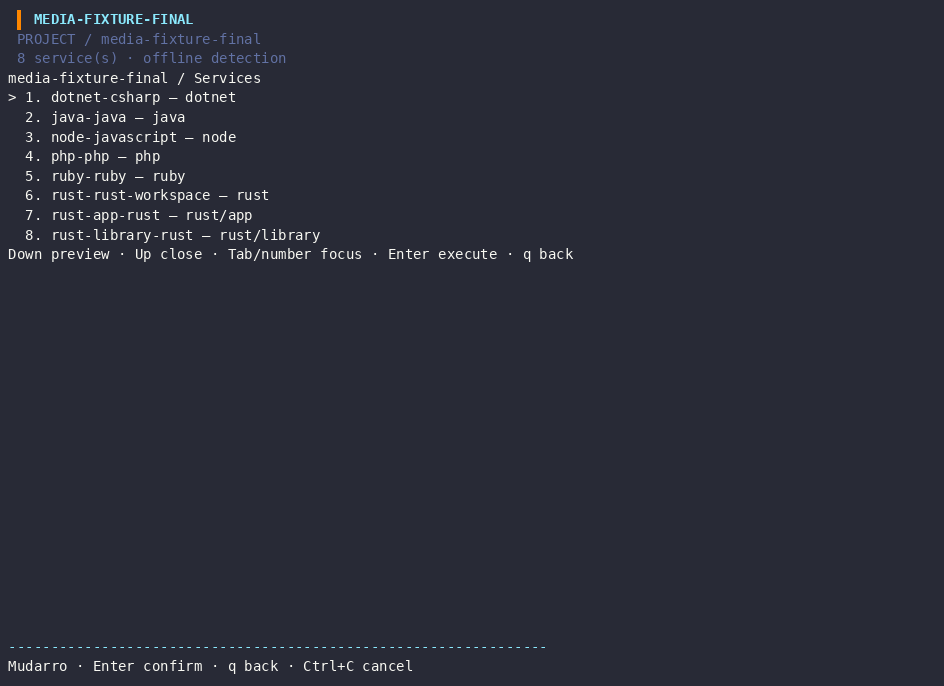
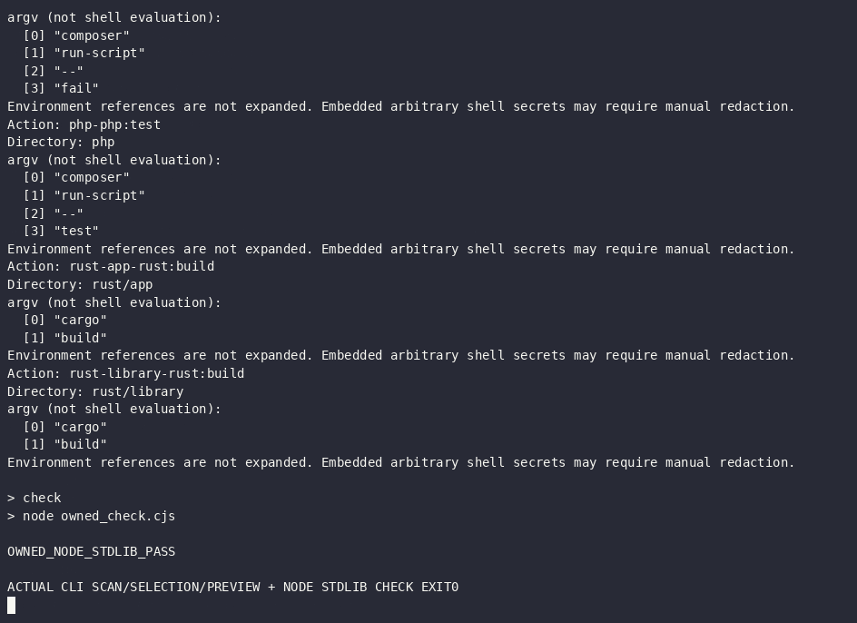

## Latest approved runtime checkpoint / Rodada runtime autorizada

Rust46, JDK/Maven18 and .NET31 checks met expectations using the four approved private tools. Maven only executable version; dotnet only zero-package console self-test. See [actual runtime evidence and reproduction](runtime/README.md). Older static checkpoint below is historical. No publication of this batch.

# Next language static contracts — local final checkpoint

235 top-level test groups passed with race, zero failed and zero test skips. Four packages contain no tests. Canonical union coverage: 3050/3672 statements (83.06%). Race, vet, Linux build, Darwin arm64 cross-build, supervisor smoke, automatic-menu shell checks and actual PTY resize all exited zero. Darwin native execution was not performed.

| Scope | Approved and verified contract | Runtime boundary |
|---|---|---|
| Rust/Cargo | Bounded TOML, explicit package/lib/bin and literal members/default-members; opt-in build/test; collisions and unresolved ownership diagnosed | Cargo/rustc/build.rs not executed; explicit package.workspace stays pending |
| Java/Maven | Bounded XML, independent explicit modules, opt-in compile/test | JDK/Maven absent; no plugins/profile evaluation |
| Gradle/Kotlin | Identification/evidence only, pending explicit configuration | No DSL, wrapper or task execution |
| PHP/Composer | Strict JSON and explicitly named string scripts; argument-safe opt-in | PHP/Composer absent; arrays/plugins/hooks not evaluated |
| C#/.NET | Bounded project/solution evidence and explicit per-project build/test options | dotnet absent; no MSBuild/property evaluation |
| Ruby | Gemfile/gemspec identification and bounded evidence only | Ruby/Bundler absent; no DSL/Rake/Rails execution |
| Node/Python frameworks | Declared dependency metadata and existing explicit entrypoints preserved | Actual checks use existing Node/Python stdlib only; Flask/Express/pytest not executed |

Negative cases cover invalid/oversized/duplicate manifests, outside/symlink/excluded paths, ambiguous ownership and ID collisions. Existing configuration preservation and repeated generation are verified. Generic service ID collisions now warn and retain a valid deterministic configuration; virtual Cargo workspace IDs are distinct from member IDs. No executable startup is inferred by these new adapters.

[Detailed results](summary.json), [gate commands](gate-results.json), [raw Go test events from the final unchanged-source rerun](runtime/gates/race.stdout), [coverage](coverage.out), [reproduction](reproduction.md), and individual profile READMEs contain the evidence and limits.

## Actual terminal recording

[Original cast](static-contracts.cast) and [media validation](media-validation.json): owned PTY, injected q documented, restored terminal settings, 4 decoded GIF frames at944×686. PNGs are decoded frames of actual terminal output. No browser or desktop capture was used; graphical-capture activity MUD008 remains blocked. Menu/preview is real Mudarro execution; previewing Cargo/Composer/Maven/dotnet argv is not execution of those tools. Only the existing Node stdlib sample was run in this recording.

This batch is local and unpublished. Prior MUD044/045 is published as c400f99 with personal API author/committer daneiel, 89 files, unchanged staged tree and two zero-Action observations ([commit](https://github.com/viralabs-dev/mudarro/commit/c400f99eaf703d46321636468282cbe262195941)); absence of runs is not CI success. No new tool installation took place. Installation approval remains a separate decision.
