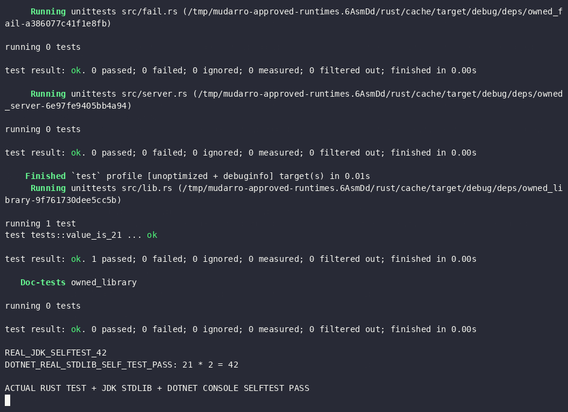
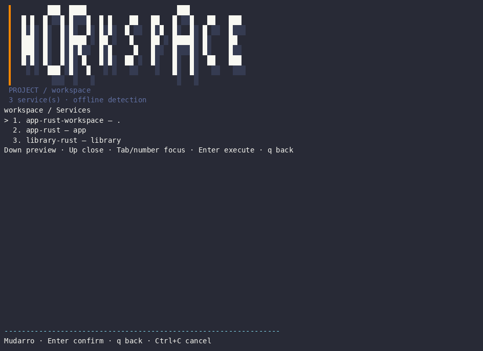

# Approved private runtime validation

Daniel authorized Rust/Cargo1.99.0, TemurinJDK25.0.4.1+1, Maven3.10.0 and .NETSDK10.0.401 at20:35:52UTC. Official sources and exact hashes matched before extraction; archive member/link containment was checked. Installations remain exclusively under /tmp/mudarro-approved-runtimes.6AsmDd, without sudo/global/shell-profile changes. HOME is preserved and tool-specific caches are private.

| Actual coverage | Results | Boundaries |
|---|---|---|
| Rust/Cargo | 46 commands offline; build/test, library assertion, bin42, expected failures7/101, wrappers/config preservation, explicit service up/status/logs/restart/down/stopped | No external crates, no negative build.rs execution; no startup inferred |
| JDK/Maven | 18 checks; javac/java self-test42, failure7, Mudarro actions/wrapper; exact Maven version | Maven only -version; build/test preview only, repo empty; Gradle/Kotlin not executed |
| .NET | 31 commands; zero-package console build/self-test42, direct failure7/CLI1, compile failure and recovery, idempotence/preservation | No dotnet test/test-framework/NuGet downloads/workloads/certificates/globaltools |

Final repository gates again passed:235 top-level race groups,0failed/0testskip,4packages without tests;3050/3672 statements83.06%. Vet, Linux build, Darwin arm64 cross-build, smoke, menu and PTY resize passed. No production change was needed in this runtime round. Darwin native remains unexecuted. Controlled failures are expected-case passes, not failing validation.

[Aggregate results](summary.json), [recorded commands](validation.json), [gate commands](gate-results.json), [Rust source/logs/reproduction](../rust/runtime/README.md), [Java source/logs/reproduction](../java/runtime/README.md), [dotnet source/logs/reproduction](../dotnet/runtime/README.md).

## Genuine owned-terminal recording

[Original cast](runtime.cast):63 output events,exit0,terminal settings restored, injected q after1.5s. GIF5frames944×686 fully decoded; PNG frames0/4 inspected. No browser or desktop capture. Recording executes app-rust:test plus library-rust:test (one actual library test), Java stdlib self-test and dotnet explicit console self-test. It does not execute Maven lifecycle or start a service. Existing zero-test binary targets are not represented as substantive tests.

This batch remains local/unpublished. PHP/Composer, PostgreSQL, Ruby, Podman and WSL were not installed or started. [Separate Maven plugin proposal](../../next-adapter-preparation/queue/install-plans/finalization/jvm-dotnet/plugin-approval-request.md) lists35known+3provider candidates;33have only officialSHA1, runtime closure remains unproven. No plugin JAR downloaded/executed; further approval required.
