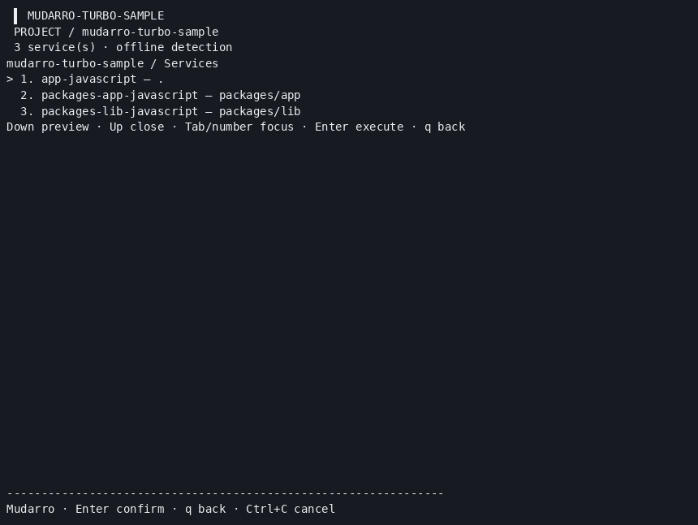

# MUD-037 — explicit orchestration tasks (validated locally, unpublished)

## Final runtime checkpoint — approved and executed

**186 race tests PASS, zero failures/test skips; 2530/3109 production statements (81.38%).** Includes the optional interactive PTY test and the new before-fail/after-pass exact-key Nx regression. [Final summary](final-summary.json), [events](final-tests.jsonl), [coverage](final-coverage.out). Final binary SHA256 `00927bb14ab3bdacaa07dd1292e949249efa230bdd1b7bd9c6dcd6cff699c331`; vet/builds/smoke/menu/resize PASS. Earlier184 results below are historical.

Daniel approved the exact four packages (Sentinel_263b75502cd081919333014f85f54c86). [Install and integrity proof](runtime/installation/lock-audit.json): official origins, direct SRI matches, scripts disabled; 2Turbo/126Nx actual installed packages. Node24.15.0/npm11.12.1 already existed. Private prefix `/tmp/mudarro-orchestrators.c6vPF6`; no global installation.

| Real flow | Result |
| --- | --- |
| Turbo2.11.7 build/test/lib→app21→42 | PASS; [33 recorded commands](runtime/turbo/results.json), [summary](runtime/turbo/summary.json) |
| Turbo dependency ordering/cache/local repeat/changed-input | PASS; cold MISS→local HIT both→MISS both; timing summaries retained |
| Nx23.2.1 build/test/dependencies/lib→app21→42 | PASS; [17 final checks](runtime/nx/summary.json) |
| Nx cache/repeat/changed-input | PASS; repeat2/2hits, changed source0/2hits real rebuild |
| Deliberate child exit7 / missing tasks | Expected failures: Turbo7, Nx1; Mudarro/wrappers1; no false success |
| Both Mudarro scan/select/preview/run/wrappers/config preservation/generate twice | PASS and final binary rechecked |
| Final real PTY menu + selected test task | PASS; fresh local cache, actual task markers, exit0, terminal settings restored |

Corrections retained: Turbo rejects force+cache and default no-Git input hashing included generated outputs; fixture now has explicit inputs/globalDependencies. Nx explicit targets require cache:true, explicit input sets; workspace-local symlink to audited Nx distribution and local sockets for three built-in plugins were required. Installed CLI is `nx/dist/bin/nx.js`. PTY analytics prompt recovered by analytics:false ONLY in controlled nx.json; no personal preferences changed. Scan itself never executes these plugins. Nx daemon/cloud and install hooks remain disabled.

All GIF frames decoded (Turbo11/Nx7 at944×647); PNG final frames10/6 visually inspected. No browser/desktop capture. [Reproduce with approved private tools](reproduction.md). Final samples include source/config/lock/generated wrappers, exclude dependencies/cache/dist/state/binaries. No framework/PnP/imported graph/JSONC/inferred-target support or native macOS/WSL/Podman/physical mouse/font acceptance claim. MUD-037 locally complete; publication requires separate approval.

## Historical pre-install checkpoint

184 top-level tests PASS with race; optional PTY recording separately PASS, zero failures. Production coverage union: 2523/3105 statements (81.26%). Coverage keys are merged by source block using the maximum count across mirrored test packages; the final published profile is canonicalized this way, raw profile retained locally. Vet, Linux build, Darwin arm64 cross-build, smoke, real CLI menu/config and PTY resize PASS. [Summary](summary.json), historical full184events/profile retained locally outside the proposed publication subset, [actual sample CLI outputs](cli-evidence.json).

Turbo `tasks` and named Nx `project.json` targets become opt-in suggestions owned by their declared JavaScript root. Scan executes no plugins/managers and invents no startup. Strict JSON only; no JSONC, graph/plugin/default/extends inference. Duplicate names, normalized collisions, unsafe tokens, invalid owners/sources are diagnosed. Invalid Turbo does not hide valid Nx.

| Matrix | Result |
| --- | --- |
| Explicit tasks, root ownership, nested roots, opt-in/no invented start | PASS |
| Invalid JSON/owner, symlinks/excludes, unsafe names, collisions | PASS |
| Independent invalid Turbo + valid Nx | PASS |
| Real scan/select/preview, manual config preservation, generate twice | PASS, both source samples |
| Direct Node task bodies, dependency output 21→42, negative ordering/failure exit7 | 12 checks PASS; not orchestration |
| Turbo/Nx dependency scheduling, cache/repeat/input invalidation/failure propagation | NOT RUN: installation approval pending |

[16 source/config sample files](samples/turbo/package.json) exclude dist, node_modules, caches and binaries. [Nx sample](samples/nx/nx.json), [reproduction](reproduction.md), [installation plan](plan/runtime-plan.md). Exact requested tools: turbo@2.11.7 + @turbo/linux-64@2.11.7; nx@23.2.1 + @nx/nx-linux-x64-gnu@23.2.1, official npm registry/SRI, existing Node24.15.0/npm11.12.1, fresh private /tmp prefixes/config/cache, lifecycle scripts disabled. No installation performed. MUD-037 remains blocked, not completed. No commit/push of this batch.

[Original cast](menu.cast), [capture validation](record-validation.json). Two decoded GIF frames860×647; PNGframe0 inspected. Real application PTY with injected exit; this records the generated service menu, not successful orchestration task execution. No browser used. Desktop screenshot, physical mouse/font acceptance, native macOS/WSL/Podman remain pending.
