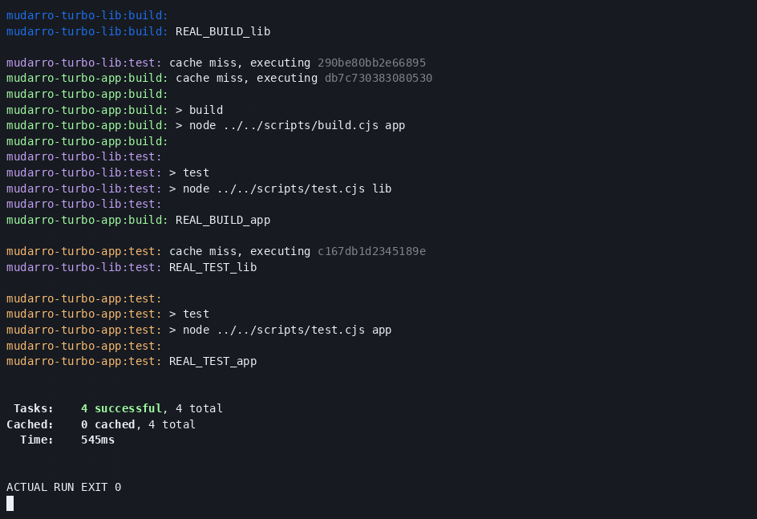
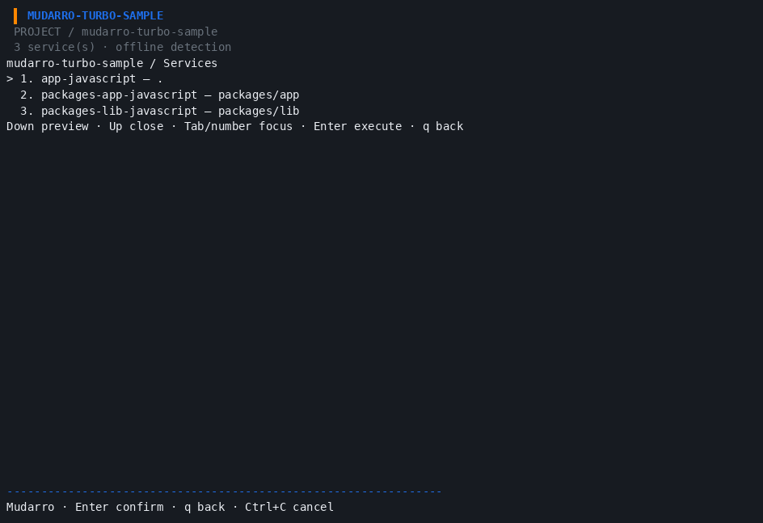
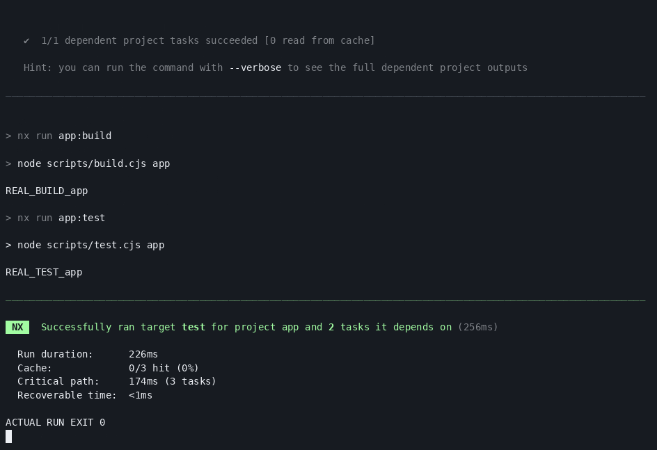
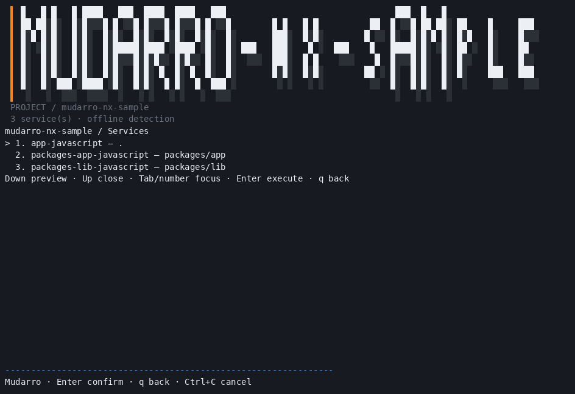

# MUD-037 — orquestração explícita validada localmente

**186 testes PASS com race, zero falhas/testes pulados; cobertura produção2530/3109=81,38%.** Inclui gravação PTY opcional e regressão de chaves Nx em maiúsculas reproduzida antes e corrigida depois. Vet, builds Linux/Darwinarm64(compilação cruzada), smoke, menu/configuração e resizePTY passaram. [Resumo final](final-summary.json), [eventos](final-tests.jsonl), [matriz/evidências completas](README.md).

Daniel aprovou os quatro pacotes exatos; instalados por registro oficial npm, SRI conferidos, scripts desativados, prefixos/cache/config privados em /tmp, Node24.15/npm11.12 existentes. Sem instalação global. [Auditoria](runtime/installation/lock-audit.json).

| Fluxo real | Resultado |
| --- | --- |
| Turbo2.11.7 build/test, lib→app21→42, ordenação | PASS;33comandos registrados |
| Turbo cache frio/repetição/mudança de entrada | MISS→HIT local ambos→MISS ambos |
| Nx23.2.1 build/test/dependências | PASS;17checks finais |
| Nx repetição/mudança de entrada | 2/2hits→0/2hits e rebuild real |
| Falha deliberada7/target ausente | Rejeições esperadas; Turbo7/Nx1, Mudarro/wrapper1 |
| Scan/select/preview/run/wrappers/configuração preservada/generate2 | PASS com binário final |
| Menu+test real em PTY e cache privado novo | PASS; exit0 e termios restaurado |

Samples finais em runtime/samples/{turbo,nx}: fontes/config/locks/wrappers, sem node_modules/dist/cache/estado/binários. [Reprodução](reproduction.md). Scan não executa plugins nem inventa startup: somente tarefas explícitas selecionáveis, JSON estrito, ownership/ambiguidades/collisões diagnosticados. Sem inferência de grafos/plugins/defaults/JSONC.

Correções do roteiro preservadas: Turbo rejeita force+cache; hashing sem Git incluiu outputs/logs, resolvido com inputs explícitos e scripts globais. Nx requer cache:true/inputsets; ligação simbólica somente do sample para a distribuição auditada e sockets locais de workers (três plugins internos). Entrada instalada Nx é dist/bin/nx.js. Pergunta interativa de analytics resolvida com analytics:false apenas no nx.json controlado, sem preferências pessoais. Daemon/cloud/hooks continuam desativados.

GIFs totalmente decodificados: Turbo11/Nx7frames944×647; PNGs frames10/6 inspecionados. Captura genuína do aplicativo em PTY, entrada q injetada para sair do menu e executar test; nenhum navegador/desktop/imagem sintética. Binário SHA00927bb14ab3bdacaa07dd1292e949249efa230bdd1b7bd9c6dcd6cff699c331.

MUD-037 concluído localmente sobre05702cc, sem commit/push deste lote. Native macOS/WSL/Podman, mouse/fonte físicos e captura gráfica seguem pendentes. Não há alegação de suporte completo a frameworks/PnP/targets inferidos. Checkpoint histórico184 e12checksNode somente corpos de tarefas permanecem documentados no README EN.
