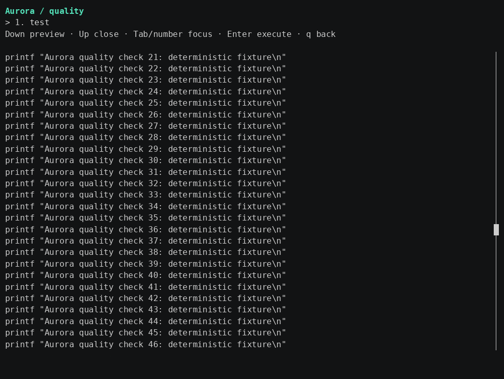
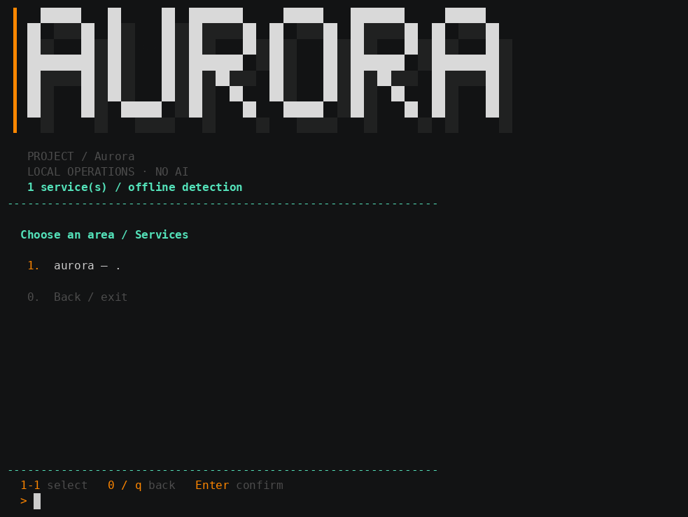

English · [Português (Brasil)](pt-BR/ui-configuration.md)

[Jump to recorded screens](#recorded-screens).

## Current CI correction — MUD-030

Verified [push CI run37416072569](https://github.com/viralabs-dev/mudarro/actions/runs/37416072569), head `bade86e`: completed **failure**. Ubuntu, database and container jobs succeeded; macOS executed and failed in EOF-loop/race-cleanup handling, including panic with index n=-1. Therefore macOS is no longer globally “not executed”: local Darwin cross-compilation passed, but the actual CI runtime failed. Local Podman remains unavailable; container CI passed, distinct from local execution.

Authenticated Actions permissions read returned enabled=true/allowed_actions=all; this does not identify who changed settings. No workflow/config settings, enable action, dispatch or rerun was performed. This corrective commit uses the official [skip ci] marker for the authorized main-only push, honoring the requested no-Actions execution without changing settings. Earlier raw gates/evidence are preserved as historical and superseded for current CI status. Local Linux74-test/76.38% results remain valid for their recorded checkpoint. The portability fix passed 75 local Linux tests with race, vet and Linux/Darwin arm64 compilation. Corrected macOS runtime remains unvalidated; skipping CI does not mean it passed.

## Current configurable-UI gate

**74 Test functions passed with race; 1,552/2,032 executed statements = 76.38% (Go displays76.4%)**, 480 unexecuted. Terminal package:379/422=89.81%. Vet, Linux build and whole-binary Darwin arm64 cross-build passed; compilation does not validate macOS runtime. Genuine UI E2E passed custom-config wrapper/supervisor propagation, localized scan, read-only preview and secret redaction, plus smoke/menu execution. Final Python/Go language and pnpm real E2Es passed; Dockerfile and eight database combinations with existing dependencies also passed. Previous stage counts/coverage below remain historical with different denominators. Font integration and actual-emulator mouse acceptance remain pending.

Evidence: [tests-race.txt](samples/menu-auto/evidence/ui-configuration/tests-race.txt), [coverage.out](samples/menu-auto/evidence/ui-configuration/coverage.out), [coverage-functions.txt](samples/menu-auto/evidence/ui-configuration/coverage-functions.txt), [coverage-summary.tsv](samples/menu-auto/evidence/ui-configuration/coverage-summary.tsv), [vet.txt](samples/menu-auto/evidence/ui-configuration/vet.txt), [smoke.txt](samples/menu-auto/evidence/ui-configuration/smoke.txt), [menu-real.txt](samples/menu-auto/evidence/ui-configuration/menu-real.txt), [ui-real.txt](samples/menu-auto/evidence/ui-configuration/ui-real.txt).


# UI configuration

## Recorded screens

Real CLI execution in a PTY with controlled input. PNGs are rendered recording frames, not desktop screenshots. The banner and footer remain fixed while the center shows menus, preview and execution.

**Recorded revision:** these real screens accompany the persistent shell added by MUD-032. Previous recordings are preserved; validation below was performed locally, independently of CI.

### Dark · English


Frame of real long output with the banner and footer preserved.


Animated GIF of the real session: preview, execution, error, input, cancellation and return to the menu.

### Light · Portuguese


Frame of real long output with the banner and footer preserved.


Animated GIF of the real session: preview, execution, error, input, cancellation and return to the menu.


Implemented: one internal Config model and common validation for YAML/JSON, optional version1 ui settings, translated Mudarro-owned messages, semantic themes and read-only action previews. Font integration and real-emulator mouse acceptance remain unimplemented/unverified respectively. Historical evidence is retained; final consolidated coverage is recorded below.

## Selection and defaults

Use --config with a guarded project-relative path, including custom YAML/JSON names. Without it, exactly one mudarro.yaml or mudarro.json is selected; both produce an explicit ambiguity error, neither the missing-config error. No merging. Init defaults YAML; --format json selects JSON. Existing --json controls output, not configuration format. Generated wrappers preserve selected config path in quoted structured arguments; the local supervisor propagates that selection.

CLI UI overrides take precedence over the selected file and built-in defaults. No global config or automatic environment locale guessing. Defaults: locale=en, theme=auto, density=comfortable, lettering=auto, preview.enabled=true, preview.mouse=auto. Locales en/pt-BR; themes auto/light/dark; density comfortable/compact; lettering auto/ascii/text. Unknown fields, duplicate keys, trailing/multiple documents, invalid types/enums and guarded path/size/symlink rules are validated. Older strict binaries reject ui fields; rollback requires explicit removal, not silent rewriting.

```yaml
version: 1
name: Aurora
ui:
  locale: pt-BR
  theme: dark
  density: compact
  lettering: auto
  preview:
    enabled: true
    mouse: auto
services:
  - id: app
    dir: .
    infrastructure: {kind: custom}
    commands:
      test: {args: [npm, test], group: qualidade}
```

```bash
mudarro init --format json
mudarro menu --config project.json --locale en --theme light
```

Identifiers, configuration/group keys, argv and destructive-confirmation tokens remain stable. External process output is not translated. Themes select contrasting semantic foreground colors, preserving emulator background; NO_COLOR disables color but not keyboard access where interactive capabilities exist. A CLI cannot universally select font family; no font installation/global terminal change is implemented.

## Action preview and input

Raw interaction is restricted to action views, leaving service/group selection in compatible line mode. Numbers/Tab/Shift-Tab focus actions; Enter executes explicitly; Down expands preview, Up collapses. PageUp/PageDown/Home/End and mouse wheel scroll; scrollbar click/drag handles reported mouse events. Merely focusing, expanding or scrolling never invokes Runner. Destructive confirmation stays mandatory. Fallback line mode supports pN for a read-only preview and ordinary numeric execution.

Preview shows cwd, argv/shell/source and labeled planned special-action sequences. It never executes commands, inspects processes/containers, sources scripts, loads .env or expands environment values. Environment references remain placeholders; recognized secret flags/URL credentials are redacted. Arbitrary embedded free-form shell secrets cannot be inferred reliably; recordings use nonsecret fixtures. File previews are guarded and bounded.

Raw mode requires supported input/output TTYs; restoration covers normal exit/EOF/errors/interruption and occurs before handing stdin to a child, then reacquires after completion. SIGKILL cannot run cleanup. Pipes/dumb terminals remain plain without mouse/cursor modes. Conservative Unicode cell estimation is not perfect grapheme handling. Mouse protocol events were exercised through isolated PTYs, not accepted in an actual emulator; graphical screenshot remains pending. See [plan and limits](ui-configuration-plan.md), [configuration](configuration.md), [visuals](terminal-visual.md).

## Earlier recorded preview

Checkpoint before the persistent shell, retained as history.




